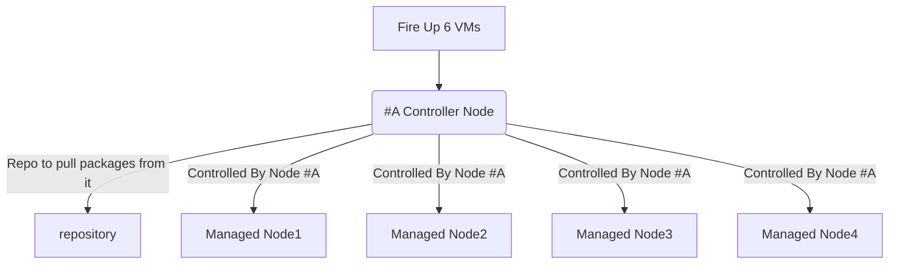

# Ansible Sample Exam for RHCE EX294

This is a sample Ansible exam that I’ve created to prepare for the new RHCE exam EX294. As with the real exam, no perfect answers to the sample exam questions will be provided, but more or less correct and accurate.

## Requirements

There are 18 questions in total could be more or less.
You will need five RHEL 8 virtual machines to be able to successfully complete all questions.

One VM will be configured as an Ansible control node. Other four VMs will be used to apply playbooks to solve the sample exam questions. The following FQDNs will be used throughout the sample exam.

| FQDN                      | Description                            |
| ------------------------- | -------------------------------------- |
| repo.ansi.example.com     | install packages from                  |
|                           | http://repo.ansi.example.com/BaseOS    |
|                           | http://repo.ansi.example.com/AppStream |
| control.ansi.example.com  | Ansible control node                   |
| managed1.ansi.example.com | managed host                           |
| managed2.ansi.example.com | managed host                           |
| managed3.ansi.example.com | managed host                           |
| managed4.ansi.example.com | managed host                           |



## Lab Setup

> you can create the lab setup manually, but instead i've `Vagrantfile` which you can use inorder to create this setup, please go to this website for more information regarding lab setup https://github.com/rdbreak/rhce8env

## Q1. Ansible Installation and Configuration

- Install the ansible package on the control node
- Create automation user with devops password
- You have root access to all five servers
- the `automation` user should be allowed to execute any command without providing password to the prompt "Add the automation user to sudoers group"
- Create inventory on the control node at /home/automation/plays/inventory. Meet following requirements:

  - managed1.example.com should be a member of the proxy host group
  - managed1.example.com should be a member of the proxy host group
  - managed2.example.com should be a member of the webservers host group
  - managed3.example.com should be a member of the webservers and database host group
  - managed4.example.com should be a member of the database host group
  - proxy and webservers belong to group named public

- Create a config file at /home/automation/plays/ansible.cfg with following requirements:
  - priviledged escalation is disabled by default
  - ansible should manage 8 hosts at a single time
  - use previously defined inventory file by default
  - uses /var/log/ansible/execution.log to save information related to playbook execution
  - roles path should include /home/automation/plays/roles
  - ensure that priviledge escalation method is set to sudo
  - do not allow ansible to ask for password when elevating privileges

## A1. Ansible Installation and Configuration

> Manage your `/etc/hosts` file to resolve host ip address to FQDNs, in a real exam they will give you a FQDN and you need to create an entry in `/etc/hosts` file, Remember that **You have root access to all five servers**.

```
192.168.55.199 repo.ansi.example.com     repo
192.168.55.200 control.ansi.example.com  control
192.168.55.201 node1.ansi.example.com    managed1
192.168.55.202 node2.ansi.example.com    managed2
192.168.55.203 node3.ansi.example.com    managed3
192.168.55.204 node4.ansi.example.com    managed4
```

> As root generating ssh key and copy it to the managed hosts:

```
[root@control ~]# ssh-keygen
[root@control ~]# ssh-copy-id managed1
[root@control ~]# ssh-copy-id managed2
[root@control ~]# ssh-copy-id managed3
[root@control ~]# ssh-copy-id managed4
```

> Let’s check if we can connect to the remote hosts as root without password:

```
[root@control ~]# ssh managed1
```

- **step1:** Installing the ansible

```
yum install -y ansible
```

- **step2:** Configuring the user account

> Create an account

```
useradd automation
```

> Set password

```
echo devops | passwd --stdin automation
```

- **step3:** Allow access to privileged commands

```
echo "automation ALL=(ALL) NOPASSWD:ALL" > /etc/sudoers.d/automation
```

- **step4:** Creating inventory

> Create directory for the inventory

```
mkdir -p /home/automation/plays
mkdir -p /home/automation/plays/roles
sudo mkdir -p /var/log/ansible/
sudo touch /var/log/ansible/execution.log
vim /home/automation/plays/inventory
```

> Create the inventory with following contents

```
[proxy]
managed1

[webservers]
managed2
managed3

[database]
managed3
managed4

[public:children]
webservers
proxy
```

> Save it to /home/automation/plays/inventory

- **step5:** Create the config file with following content

> Create the ansible.cfg `ansible configuration file` with following contents

```
[defaults]
remote_user=automation
inventory=./inventory
host_key_checking=false
log_path=/var/log/ansible/execution.log
roles_path=/home/automation/plays/roles
forks=8

[privilege_escalation]
become=false
become_ask_pass=false
become_method=sudo
become_user=root
```

> Save it to /home/automation/plays/ansible.cfg

General thoughts

Ensure that you have proper ownership, to restore it call

```
chown -R automation:automation /home/automation
```

> Do the same for /var/log/ansible directory

```
sudo chown -R automation:automation /var/log/ansible
```

## A2. Ad-Hoc Commands

Generate an SSH keypair on the control node. You can perform this step manually.

- Write a script `/home/automation/plays/adhoc` that uses Ansible ad-hoc commands to achieve the following:
  - User automation is created on all inventory hosts (not the control node).
  - SSH key (that you generated) is copied to all inventory hosts for the automation user and stored in `/home/automation/.ssh/authorized_keys`.
  - The automation user is allowed to elevate privileges on all inventory hosts without having to provide a password.

> **After running the adhoc script on the control node as the automation user, you should be able to SSH into all inventory hosts using the automation user without password, as well as a run all privileged commands.**

## Q2. Ad-Hoc Commands

- **step1:** you should test ansible adhoc commands before writing the bash script, the command `ansible localhost -m ping` is usefull, use it few times against target hosts to verify connectivity

- **step2:** you should read and understand the inventory file, if you haven't wrote your inventory by yourself, then you can check the inventory file in this repository.

```
#!/bin/bash
# Create the directory for ssh keys.
ansible localhost -m file -a "path=/home/automation/.ssh state=directory"
# Generate the ssh keys.
ansible localhost -m openssh_keypair -a "path=/home/automation/.ssh/id_rsa owner=automation group=automation type=rsa"
# Create automation user on managed nodes.
ansible all -m user -a "name=automation password={{ 'devops' | password_hash('sha512') }}"
# share public key to managed nodes, remember to check your ansible.cfg configuration because this command needs sudo privileges.
ansible all -m authorized_key -a "key={{ lookup('file', '/home/automation/.ssh/id_rsa.pub') }} user=automation state=present"
# Add the automation user in each managed node to sudoers group for privilege escalation.
ansible all -m copy -a "content='automation ALL=(root) NOPASSWD:ALL' dest=/etc/sudoers.d/automation"
```

## Q3. Archiving

- Create a playbook that meets following requirements:
  - Creates a gzip archive containing `/etc` and stores it at `/backup/configuration.gz` on the managed hosts.
  - Is placed at `/home/automation/plays/archive.yml`
  - Runs against `all` host group
  - Retrieves archives from the managed nodes and stores them at `/backup/<hostname>-configuration.gz` on the control node
  - User automation should be owner of /backup and everything underneath. Both on the managed hosts and the control node. Only owner and members of his group should be able to read and manage files inside. Anyone should be allowed to list contents of `/backup`.

## A3. Archiving

```
- name: Archiving
  hosts: localhost
  become: true
  gather_facts: false
  tasks:
    - name: Create a backup folder
      file:
        path: '/backup'
        state: 'directory'
        owner: automation
        group: automation
        mode: 0755

- name: Archive config files
  hosts: all
  become: true
  gather_facts: false
  tasks:
    - name: Create a folder for archive
      file:
        path: /backup
        owner: automation
        group: automation
        state: directory
        mode: 0755

- name: create the archive
  hosts: all
  become: true
  gather_facts: false
  tasks:
    - name: create the archive
      archive:
        path: /etc
        dest: /backup/configuration.gz
        format: gz
        owner: automation
        group: automation
        mode: 0660

- name: fetch the archive
  hosts: all
  become: true
  gather_facts: false
  tasks:
    - name: Retrieves archives from managed nodes
      fetch:
        src: /backup/configuration.gz
        dest: /backup/{{ ansible_hostname }}-configuration.gz
        owner: automation
        group: automation
        mode: 0660
```

## Q4. Group differentiation "File Content"

- Create a playbook `/home/automation/plays/motd.yml` that runs on all inventory hosts and does the following:
  - Populates /etc/motd with text, its content depends on the group, The
  - proxy group should use `Welcome to HAProxy server` as the motd.
  - database group should use `Welcome to MySQL database` as the motd
  - webservers should use `Welcome to Apache server` as the motd.
  - Is placed at `/home/automation/plays/motd.yml`

## A4. Group differentiation "File Content"

- **step1: **Create directories for groups

```
mkdir -p /home/automation/plays/group_vars
mkdir -p /home/automation/plays/group_vars/{proxy,database,webservers}
```

- **step2: **Populate yml for each group group

```
echo "motd: Welcome to HAProxy server" > /home/automation/plays/group_vars/proxy/motd.yml
echo "motd: Welcome to MySQL database" > /home/automation/plays/group_vars/database/motd.yml
echo "motd: Welcome to Apache server" > /home/automation/plays/group_vars/webservers/motd.yml
```

- **step3: **Create the `motd.yml` playbook

```
- name: file content distributed on managed hosts
  hosts: all
  become: true
  gather_facts: false
  tasks:
    - name: populate the /etc/motd file
      copy:
        content: "{{ motd }}"
        dest: /etc/motd
        owner: root
        group: root
        mode: 644
```

> Another way of solving the problem:

```
- name: Changing MOTD
  hosts: all
  become: yes
  tasks:
  - name: Copy the content to HAProxy
    copy:
      content: "Welcome to HAProxy server\n"
      dest: /etc/motd
    when: "'proxy' in group_names"
  - name: Copy the content to Apache
    copy:
      content: "Welcome to Apache server\n"
      dest: /etc/motd
    when: "'webservers' in group_names"
  - name: Copy the content to MySQL
    copy:
      content: "Welcome to MySQL server\n"
      dest: /etc/motd
    when: "'database' in group_names"
```

## Q5. Ansible Facts

- Create a playbook that meets following requirements:
  - Is placed at `/home/automation/plays/ansible_facts.yml`
  - Runs against proxy group
  - Results in possiblity of getting a pair `name=haproxy` from ansible facts path `ansible_local.environment.application` after calling setup module

## A5. Ansible Facts

```
- name: Work with Ansible Facts
  hosts: database
  become: yes
  tasks:
  - name: Ensure directory is exist
    file:
      path: /etc/ansible/facts.d
      state: directory
      recurse: yes
  - name: Copy the content to the file
    copy:
      content: "[application]\nname=haproxy\n"
      dest: /etc/ansible/facts.d/environment.fact
```

## Q5: Work with Ansible Facts

Create a playbook `/home/automation/plays/facts.yml` that runs on hosts in the `database host group` and does the following:

A custom Ansible fact `server_role=mysql` is created that can be retrieved from `ansible_local.custom.sample_exam` when using Ansible setup module.

## A5: Work with Ansible Facts

```
- name: Work with Ansible Facts
  hosts: database
  become: yes
  tasks:
  - name: Ensure directory is exist
    file:
      path: /etc/ansible/facts.d
      state: directory
      recurse: yes
  - name: Copy the content to the file
    copy:
      content: "[sample_exam]\nserver_role=mysql\n"
      dest: /etc/ansible/facts.d/custom.fact
```

## Q6. Text Manipulation also called "Configure SSH Server"

- Create a playbook that customizes ssh configuration with following requirements:
  - Is placed at `/home/automation/plays/ssh_config.yml`
  - Is run against all servers
  - Disables X11 forwarding
  - Sets maxminal number of auth tries to 3

## A6. Text Manipulation also called "Configure SSH Server"

```
- name: SSH configuration
  hosts: all
  become: true
  gather_facts: false
  tasks:
    - name: Replace a SSH entry with our own
      lineinfile:
        path: /etc/ssh/sshd_config
        regexp: '^#MaxAuthTries 6'
        line: "MaxAuthTries 3"
      notify: Restart ssh
    - name: Replace a SSH entry  with our own
      lineinfile:
        path: /etc/ssh/sshd_config
        regexp: '^X11Forwarding yes'
        line: 'X11Forwarding no'
      notify: Restart ssh
  handlers:
    - name: Restart ssh
      service:
        name: sshd
        state: restarted
```

## Q7. Use Conditionals to Control Play Execution "Conditionals"

- Create a playbook that meets following requirements:
  - Is placed at `/home/automation/plays/system_control.yml`
  - Runs against all hosts
  - If a server has more than 1024MB of RAM, then use sysctl to set `vm.swppiness to 10`
  - If a server has less or equal to 1024MB of RAM exist with error message Server has less than required 1024MB of RAM
  - Configuration change should survive server reboots

## A7. Use Conditionals to Control Play Execution "Conditionals"

```
- name: Configure sysctl parameter
  hosts: all
  vars:
    ram_mb: 1024
  tasks:
    - name: If server has less than 1024Mb
      fail:
        msg: Server should have at least {{ ram_mb }}MB of ram
      when: ansible_memtotal_mb < ram_mb
    - name: Configure swappiness
      become: true
      sysctl:
        name: vm.swappiness
        value: '10'
        sysctl_set: true
        reload: true
```

## Q8. YUM repositories

- Create a playbook that meets following requirements:
  - Is placed at `/home/automation/plays/yum.yml`
  - Runs against database hosts
  - Adds a definition of new yum repository
  - Enables this repository in yum
  - Enables GPG check for this repo, key can be found here `https://repo.mysql.com/RPM-GPG-KEY-mysql`
  - Sets description of the repo to `"MySQL 5.7 Community Server"`.
  - Sets repo id to `mysql57-community`
  - Sets url of the repo to `http://repo.mysql.com/yum/mysql-5.7-community/el/6/$basearch/`

## A8. YUM repositories

```
- name: yum repository configuration
  hosts: database
  become: true
  gather_facts: false
  tasks:
  - name: import GPG key
    rpm_key:
      state: present
      key: https://repo.mysql.com/RPM-GPG-KEY-mysql
  - name: Add repository configuration enteries
    yum_repository:
      name: mysql57-community
      description: "MySQL 5.7 Community Server"
      baseurl: http://repo.mysql.com/yum/mysql-5.7-community/el/6/$basearch
      gpgcheck: true
      gpgkey: https://repo.mysql.com/RPM-GPG-KEY-mysql
      enabled: true
```

## Task 8: Software Repositories

- Create a playbook /home/automation/plays/repository.yml that runs on servers in the database host group and does the following:

  - A YUM repository file is created.
  - The name of the repository is `mysql80-community`.
  - The description of the repository is `“MySQL 8.0 YUM Repo”`.
  - Repository baseurl is `http://repo.mysql.com/yum/mysql-8.0-community/el/8/x86_64/`.
  - Repository GPG key is at `http://repo.mysql.com/RPM-GPG-KEY-mysql`.
  - Repository GPG check is enabled.
  - Repository is enabled.

## Solution 8: Software Repositories

```
- name: yum repository configuration
  hosts: database
  become: true
  gather_facts: false
  tasks:
  - name: import GPG key
    rpm_key:
      state: present
      key: http://repo.mysql.com/RPM-GPG-KEY-mysql
  - name: Add repository configuration enteries
    yum_repository:
      name: mysql80-community
      description: "MySQL 8.0 YUM Repo"
      baseurl: http://repo.mysql.com/yum/mysql-8.0-community/el/8/x86_64
      gpgcheck: true
      gpgkey: http://repo.mysql.com/RPM-GPG-KEY-mysql
      enabled: true
```

## Q9. Vault

- Create a file that meets following requirements:

  - Is placed at /home/automation/plays/vars/regular_users.yml
  - Is encrypted by Vault with id set to users and password to eureka
  - The file should contain a key user_password, its values should be set to devops

- Create a file that meets following requirements:

  - Is placed at /home/automation/plays/vars/database_users.yml
  - Is encrypted by Vault with password to dbs-are-awesome
  - The file should contain a key db_password, its values should be set to devops

- Create a file that meets following requirements:

  - Is placed at /home/automation/plays/secrets/regular_users_password
  - Contains eureka as the content

- Create a file that meets following requirements:
  - Is placed at /home/automation/plays/secrets/database_users_password
  - Contains dbs-are-awesome as the content

## A9. Vault

> Navigate to `/home/automation/plays` as `automation` user and create directories for the files

> Part 1: you'll need to create a separate file that contains a password "eureka" this file is used as decryption tool, so we'll first encrypt a file which contains a sensitive key value pair `user_password: devops` > `"vars/regular_users.yml"` and the only way to decrypt it is to use another file, for simplicity i chose to create this file`/home/automation/plays/secrets/regular_users_password`

```
mkdir secrets vars
```

```
echo "user_password: devops" > /home/automation/plays/vars/regular_users.yml
```

```
echo eureka > /home/automation/plays/secrets/regular_users_password
```

```
ansible-vault encrypt vars/regular_users.yml --vault-id eureka@secrets/regular_users_password
```

> Part 2: similar process but this time we don't use a vault-id

```
echo "db_password: devops" > vars/database_users.yml
```

```
echo dbs-are-awesome > /home/automation/plays/secrets/database_users_password
```

```
ansible-vault encrypt /home/automation/plays/vars/database_users.yml --vault-id @./secrets/database_users_password
```

## Task 9: Ansible Vault

Create Ansible vault file `/home/automation/plays/secret.yml`. Encryption/decryption password is devops.

Add the following variables to the vault:

user_password with value of devops
database_password with value of devops

Store Ansible vault password in the file `/home/automation/plays/vault_key`.

## Solution 9: Ansible Vault

> Step 1: put a password inside `/home/automation/plays/vault_key`

```
echo "devops" > vault_key
```

> Step 2: put a key value pair inside `/home/automation/plays/secret.yml`

```
echo "user_password: devops" > secret.yml
echo "database_password: devops" > secret.yml
```

> Step 3: encrypt the file `secret.yml`

```
ansible-vault encrypt --vault-id @vault_key secret.yml
```

> Step 4: view the content of the file `secret.yml`

```
ansible-vault encrypt --vault-id @vault_key secret.yml
```

## Q10. User Accounts

You have been given defintions of variables for the task

```
---
users:
- username: adam
  uid: 2000
- username: greg
  uid: 2001
- username: robby
  uid: 3001
- username: xenia
  uid: 3002
...
```

> Store a file with the above content at `/home/automation/plays/vars/users.yml`

- Create a playbook that meets following requirements:
- Create a playbook `/home/automation/plays/users.yml` that uses the vault file `/home/automation/plays/secret.yml` to achieve the following:
- Creates users whose uid starts with 2 on `webservers host group`. Password should - be taken from the variable stored at `/home/automation/plays/secret.yml` (created in previous exercise)
- Creates users whose uid starts with 3 on `database host group`. Password should - be taken from the variable stored at `/home/automation/plays/secret.yml` (created in previous exercise)
- Users should be part of supplementary group wheel
- Users' shell should be set to `/bin/bash`
- Password should use `SHA512` hash format
- Each user should have an SSH key uploaded (use the SSH key that you created previously, see task #2)
- After running the playbook users should be able to SSH into their servers - without providing password to prompt

## A10. User Accounts

```
- name: creatie specified users and their IDs
  hosts: all
  become: yes
  gather_facts: no

  vars_files:
  - vars/users.yml
  - secret.yml
  vars:
    hash: "{{ user_password | password_hash('sha512') }}"
  tasks:
  - name: print user_password
    debug:
      msg: "Password is {{ user_password }}, Hash is {{ hash }} "

  - name: Add the user "{{ item.username }}" with a specific uid and a primary group of 'wheel'
    user:
      name: "{{ item.username }}"
      password: "{{ user_password | password_hash('sha512') }}"
      uid: "{{ item.uid }}"
      group: wheel
      shell: /bin/bash
    loop: "{{ users }}"
    when: ( item.uid < 2002 and inventory_hostname in groups['webservers'] ) or
          ( item.uid > 2002 and inventory_hostname in groups['database'] )

  - name: Set authorized key taken from file
    authorized_key:
      user: "{{ item.username }}"
      state: present
      key: "{{ lookup('file', '/home/automation/.ssh/id_rsa.pub') }}"
    loop: "{{ users }}"
    when: ( item.uid < 2002 and inventory_hostname in groups['webservers'] ) or
          ( item.uid > 2002 and inventory_hostname in groups['database'] )
```

> Run this command to execute the `users.yml` playbook, remember it relies on our vault file for decryption.

```
ansible-playbook users.yml --vault-id @vault_key
```

> Another way of doing the same thing

```
---
- name: Create users
  hosts: all
  become: yes
  vars_files:
  - vars/users.yml
  - secret.yml
  tasks:
    - name: Ensure group is exist
      group:
        name: wheel
        state: present
    - name: Create users
      user:
        name: "{{ item.username }}"
        group: wheel
        password: "{{ user_password | password_hash('sha512') }}"
        shell: /bin/bash
        update_password: on_create
      with_items: "{{ users }}"
      when:
        - ( inventory_hostname in groups['webservers'] and "item.uid|string|first == '2'" )
        - ( inventory_hostname in groups['database'] and "item.uid|string|first == '3'" )
    - name: Set authorized key taken from file
      authorized_key:
        user: "{{ item.username }}"
        state: present
        key: "{{ lookup('file', '/home/automation/.ssh/id_rsa.pub') }}"
      loop: "{{ users }}"
      when:
      - ( inventory_hostname in groups['webservers'] and "item.uid|string|first == '2'" )
      - ( inventory_hostname in groups['database'] and "item.uid|string|first == '3'" )
```

## Task 11: Scheduled Tasks

Create a playbook `/home/automation/plays/regular_tasks.yml` that runs on servers in the `proxy host group` and does the following:

- A root crontab record is created that runs every hour.
- The cron job appends the file `/var/log/time.log` with the output from the date command.

## Solution 11: Scheduled Tasks

```
- name: regular_task
  hosts: all
  become: true
  gather_facts: false
  tasks:
  - name: Creates a cron file under /etc/cron.d
    cron:
      name: yum autoupdates
      minute: '0'
      hour: '*'
      user: root
      job: "echo /usr/bin/date >> /var/log/time.log"
    when: inventory_hostname in groups['proxy']
```

> Let’s check if playbook works:

```
ansible all -b -a "crontab -l"
```

## Task 11: Periodic job Tasks

- Create a playbook that meets following requirements:

  - Is placed at `/home/automation/plays/periodic_jobs.yml`
  - Is executed against proxy group
  - Schedules a periodic job which runs every hour on workdays. It should be executed by the root. Every time the job is span it adds separator ----- which is followed by date and list of currently pluged devices below that. Please look at provided example. Make note of date format. Save the log to `/var/log/devices.log`. Set group and owner to the `root user`.
  - Uses `at` to schedule a job that is going to be executed after 1 minute and dumps output from vmstat to `/var/log/vmstat.log`. The file should be owned by `automation user and group`. The file should be recreated each time the playbook is executed. If the playbook is executed a second time within a minute second job should not be scheduled

Example entry from two hours might look like it is presented below

```
----- 09/21/21 21:11 -----
sda      8:0    0   64G  0 disk
├─sda1   8:1    0  2.1G  0 part [SWAP]
└─sda2   8:2    0 61.9G  0 part /

----- 09/21/21 22:11 -----
sda      8:0    0   64G  0 disk
├─sda1   8:1    0  2.1G  0 part [SWAP]
└─sda2   8:2    0 61.9G  0 part /
sdb      8:16   0    5G  0 disk
```

## Solution 11: Periodic job Tasks

```
- name: crong job
  hosts: proxy
  gather_facts: false
  become: true
  tasks:
  - name: Schedule vmstat execution
    at:
      command: '/usr/bin/vmstat 1>/var/log/vmstat.log; chown automation:automation /var/log/vmstat.log'
      count: 1
      units: minutes
      unique: true
  - name: Schedule hourly job
    cron:
      name: Dump plugged devices
      minute: '0'
      hour: '*'
      day: '*'
      month: '*'
      job: "echo ----- $(date \"+%m/%d/%y %H:%M\") >> /var/log/devices.log; lsblk >> /var/log/devices.log;chown root:root /var/log/devices.log"

```

## Task 12: Software Repositories

Create a playbook /home/automation/plays/repository.yml that runs on servers in the database host group and does the following:

- A YUM repository file is created.
  - The name of the repository is mysql56-community.
  - The description of the repository is “MySQL 5.6 YUM Repo”.
  - Repository baseurl is http://repo.mysql.com/yum/mysql-5.6-community/el/7/x86_64/.
  - Repository GPG key is at http://repo.mysql.com/RPM-GPG-KEY-mysql.
  - Repository GPG check is enabled.
  - Repository is enabled.

## Solution Task 12 Software Repositories

```
- name: Software Repository
  hosts: database
  become: yes
  gather_facts: no

  tasks:

  - name: YUM repository
    yum_repository:
      name: mysql56-community
      description: MySQL 5.6 YUM Repo
      baseurl: http://repo.mysql.com/yum/mysql-5.6-community/el/7/x86_64/
      gpgkey: http://repo.mysql.com/RPM-GPG-KEY-mysql
      gpgcheck: yes
      enabled: yes

```

Check if playbook works:

```
ansible database -a "yum repolist"
```

## Task 13: Create and Work with Roles

Create a role called sample-mysql and store it in `/home/automation/plays/roles`. The role should satisfy the following requirements:

- A primary partition number 1 of size 800MB on device /dev/sdb is created.
- An LVM volume group called vg_database is created that uses the primary partition created above.
- An LVM logical volume called lv_mysql is created of size 512MB in the volume group vg_database.
- An XFS filesystem on the logical volume lv_mysql is created.
- Logical volume lv_mysql is permanently mounted on /mnt/mysql_backups.
- mysql-community-server package is installed.
- Firewall is configured to allow all incoming traffic on MySQL port TCP 3306.
- MySQL root user password should be set from the variable database_password (see task #5).
- MySQL server should be started and enabled on boot.
- MySQL server configuration file is generated from the my.cnf.j2 Jinja2 template with the following content:

```
[mysqld]
bind_address = {{ ansible_default_ipv4.address }}
skip_name_resolve
datadir=/var/lib/mysql
socket=/var/lib/mysql/mysql.sock

symbolic-links=0
sql_mode=NO_ENGINE_SUBSTITUTION,STRICT_TRANS_TABLES

[mysqld_safe]
log-error=/var/log/mysqld.log
pid-file=/var/run/mysqld/mysqld.pid
```

> Create a playbook `/home/automation/plays/mysql.yml` that uses the role and runs on hosts in the database host group.

```
- name: my mysql role playbook
  hosts: database
  become: yes
  vars_files: secret.yml

  roles:
  - sample-mysql

  tasks:
  - debug:
      msg: "{{ database_password }}"
```

> Tasks: please take a look at the MySQL notes carefully to overcome any errors

```
---
# tasks file for sample-mysql
- name: primary partition
  parted:
    device: /dev/sdb
    number: 1
    flags: [ lvm ]
    state: present
    part_end: 800MiB
  register: device_info
- name: Create a volume group on top of /dev/sda1 with physical extent size = 32MB
  lvg:
    vg: vg_database
    pvs: /dev/sdb1
    state: present
- name: Create a logical volume of 512g.
  lvol:
    vg: vg_database
    lv: lv_mysql
    size: 512M
    state: present
- name: Create a xfs filesystem on /dev/sdb1
  filesystem:
    fstype: xfs
    dev: /dev/vg_database/lv_mysql
- name: Create a file on remote systems
  file:
    path: /mnt/mysql_backups
    state: directory

- name: Mount up device by label
  mount:
    path: /mnt/mysql_backups
    src: /dev/vg_database/lv_mysql
    fstype: xfs
    state: present
- name: Ensure packages are installed
  package:
    name: "pymysql"
    state: present
- name: starting services
  service:
    name: "{{ item }}"
    state: started
    enabled: yes
  loop:
  - firewalld
  - mysqld
  notify:
  - RestartMySql

- name: Open ports on firewall
  firewalld:
    port: 3306/tcp
    permanent: yes
    immediate: yes
    state: enabled


#Both login_password and login_user are required when you are passing credentials. If none are present,
#the module will attempt to read the credentials from ~/.my.cnf, and finally fall back to using the
#MySQL default login of ‘root’ with no password.

- name: My root user password
  mysql_user:
    login_user: root
    login_password: "{{ database_password }}"
    name: root
    password: "{{ database_password }}"

- name: Adding template to my.cnf
  template:
    src: my.cnf.j2
    dest: /etc/my.cnf
  notify:
  - RestartMySql
```

> Please note, MySQL database defaults to login of ‘root’ with no password, if you try to login as -u root -p devops it will throw an error because you are trying to login with root user and providing a password {{ database }} and by default root has no password, because you haven't created a password for the root user in the first place it'll keep throwing error.

> Solution, you need to ssh hosts in database, and then use this command

```
# this would give you access to mysql database
mysql -u root
```

```
# and now you can make the root user have a password "devops", and do the same thing to managed4 and managed3
mysql> ALTER USER 'root'@'localhost' IDENTIFIED BY 'password';
```

Handlers:

```
---
# handlers file for sample-mysql
- name: RestartMySql
  service:
    name:
    - 'mysqld'
    - 'firewalld'
    state: restarted
```

Templates:

```
[mysqld]
bind_address = {{ ansible_default_ipv4.address }}
skip_name_resolve
datadir=/var/lib/mysql
socket=/var/lib/mysql/mysql.sock

symbolic-links=0
sql_mode=NO_ENGINE_SUBSTITUTION,STRICT_TRANS_TABLES

[mysqld_safe]
log-error=/var/log/mysqld.log
pid-file=/var/run/mysqld/mysqld.pid
```
