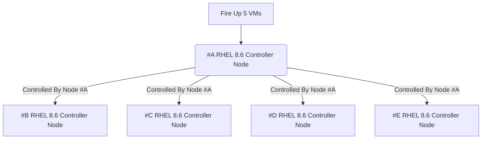

# Ansible Sample Exam for RHCE EX294

This is a sample Ansible exam that I’ve created to prepare for the new RHCE exam EX294. As with the real exam, no answers to the sample exam questions will be provided.

## Requirements

There are 18 questions in total could be more or less.
You will need five RHEL 8 virtual machines to be able to successfully complete all questions.

One VM will be configured as an Ansible control node. Other four VMs will be used to apply playbooks to solve the sample exam questions. The following FQDNs will be used throughout the sample exam.

| FQDN | Description | |
| repo.ansi.example.com | repository so you can install packages |
| control.ansi.example.com | Ansible control node |
| managed1.ansi.example.com | managed host |
| managed2.ansi.example.com | managed host |
| managed3.ansi.example.com | managed host |
| managed4.ansi.example.com | managed host |

## 1. Ansible Installation and Configuration

- Install the ansible package on the control node
- Create automation user with devops password
- the user should be allowed to execute any command without providing password to the prompt "Add the automation user to sudoers group"
- Create inventory on the control node at /home/automation/plays/inventory. Meet following requirements:

  - managed1.example.com should be a member of the proxy host group
  - managed1.example.com should be a member of the proxy host group
  - managed2.example.com should be a member of the webservers host group
  - managed3.example.com should be a member of the webservers and database host group
  - managed4.example.com should be a member of the database host group
  - proxy and webservers belong to group named public

- Create a config file at /home/automation/plays/ansible.cfg with following requirements:
  - priviledged escalation is disabled by default
  - ansible should manage 8 hosts at a single time
  - use previously defined inventory file by default
  - uses /var/log/ansible/execution.log to save information related to playbook execution
  - roles path should include /home/automation/plays/roles
  - ensure that priviledge escalation method is set to sudo
  - do not allow ansible to ask for password when elevating privileges
