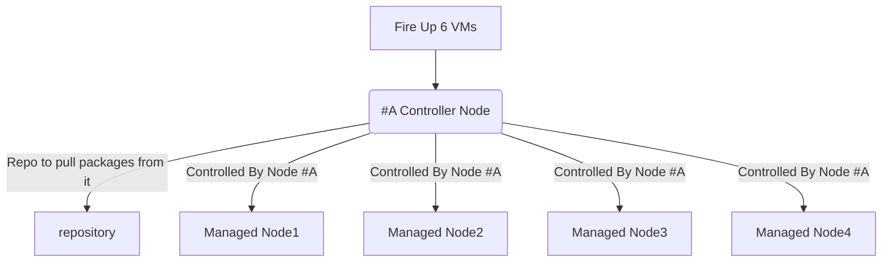

# Ansible Sample Exam for RHCE EX294

This is a sample Ansible exam that I’ve created to prepare for the new RHCE exam EX294. As with the real exam, no perfect answers to the sample exam questions will be provided, but more or less correct and accurate.

## Requirements

There are 18 questions in total could be more or less.
You will need five RHEL 8 virtual machines to be able to successfully complete all questions.

One VM will be configured as an Ansible control node. Other four VMs will be used to apply playbooks to solve the sample exam questions. The following FQDNs will be used throughout the sample exam.

| FQDN                      | Description                            |
| ------------------------- | -------------------------------------- |
| repo.ansi.example.com     | install packages from                  |
|                           | http://repo.ansi.example.com/BaseOS    |
|                           | http://repo.ansi.example.com/AppStream |
| control.ansi.example.com  | Ansible control node                   |
| managed1.ansi.example.com | managed host                           |
| managed2.ansi.example.com | managed host                           |
| managed3.ansi.example.com | managed host                           |
| managed4.ansi.example.com | managed host                           |



## Lab Setup

> you can create the lab setup manually, but instead i've `Vagrantfile` which you can use inorder to create this setup, please go to this website for more information regarding lab setup https://github.com/rdbreak/rhce8env

## Q1. Ansible Installation and Configuration

- Install the ansible package on the control node
- Create automation user with devops password
- You have root access to all five servers
- the `automation` user should be allowed to execute any command without providing password to the prompt "Add the automation user to sudoers group"
- Create inventory on the control node at /home/automation/plays/inventory. Meet following requirements:

  - `managed1.example.com` should be a member of the `proxy` host group
  - `managed2.example.com` should be a member of the `webservers` host group
  - `managed3.example.com` should be a member of the `webservers` and `database` host group
  - `managed4.example.com` should be a member of the `database` host group
  - `proxy` and `webservers` belong to group named `public`

- Create a config file at `/home/automation/plays/ansible.cfg` with following requirements:
  - priviledged escalation is disabled by default
  - ansible should manage 8 hosts at a single time
  - use previously defined inventory file by default
  - uses `/var/log/ansible/execution.log` to save information related to playbook execution
  - roles path should include `/home/automation/plays/roles`
  - ensure that priviledge escalation method is set to sudo
  - do not allow ansible to ask for password when elevating privileges

## A1. Ansible Installation and Configuration

> Before you actually start with installing ansible it's better to Check your `/etc/hosts` file which resolves host ip address to FQDNs, in RHCE exam they will give you all the FQDN of managed nodes and you don't need to create an entry in `/etc/hosts` file, Remember that **You have root access to all five servers**, in my exam it was already created. what i mean is this file was created already `/etc/hosts` and hosts file was already being populated with ip addresses and hostnames along with FQDNs, and i didn't have to create them from scratch.

> just an example so you know how they will provide you `/etc/hosts` file

```shell
[root@control ~]# cat /etc/hosts
127.0.0.1 localhost localhost.localdomain localhost4 localho    st4.localdomain4
::1 localhost localhost.localdomain localhost6 localhost6.lo    caldomain6
172.25.250.9 node1.lab.example.com node1
172.25.250.10 node2.lab.example.com node2
172.25.250.11 node3.lab.example.com node3
172.25.250.12 node4.lab.example.com node4
172.25.250.13 node5.lab.example.com node5
# and you can access nodes via ssh command
[root@control ~]# ssh node1
```

> There could be 5 managed nodes or 4 managed nodes, it doesn't matter actually, in the real exam it will be clearly defined and you can always check via `cat /etc/hosts` from the control node.

> you will have to connect to control node via ssh, the examiner would tell you the user that you will connect as to your control node which could be `lisa` or `matthew`, it doesn't matter, please don't be nervous.

```shell
ssh matthew@control
```

```
192.168.55.199 repo.ansi.example.com     repo
192.168.55.200 control.ansi.example.com  control
192.168.55.201 node1.ansi.example.com    managed1
192.168.55.202 node2.ansi.example.com    managed2
192.168.55.203 node3.ansi.example.com    managed3
192.168.55.204 node4.ansi.example.com    managed4
192.168.55.205 node4.ansi.example.com    managed5
```

> This step is not part of your RHCE exam, I just want to show you how you would actually copy your public key to managed nodes. As root generating ssh key and copy it to the managed hosts:

```
[root@control ~]# ssh-keygen
[root@control ~]# ssh-copy-id managed1
[root@control ~]# ssh-copy-id managed2
[root@control ~]# ssh-copy-id managed3
[root@control ~]# ssh-copy-id managed4
[root@control ~]# ssh-copy-id managed5
```

- step1: Installing the ansible

> In the real exam you would need to install ansible if it's installed already.

> Remember, in the real exam RHCE-294 you will be using `ansible version 2.9` or `2.8` so you will not have to use `fully qualified collection name`. in simple words, when you use ansible modules while writing ansible playbooks, you won't need to write a long name of the module `ansible.builtin.copy` but you could simply use `copy`. the reason behind this is `ansible 2.13` contains a lot of modules that were created by people from all around the world, and the only way to `differentiate between these modules` is actually by using `white-spaces` like `long names`. imagine the case if you want use a `networking module` and you want to use for example `cisco.os.bla.bla` another module could be called `cisco.os.os` as well, and if you wrote the name of the module `cisco.os` inside a playbook `ansible won't be able to fetch the right module from preinstalled collections`.

> besides, you need to know that, while studying for exam, you could be using `ansible 2.13 version` from `ansible-core` and it could be difficult for you to install the right version of ansible. so, using `ansible 2.13 version` which is a little complicated due to `fQCN`.
> you need to make sure you install additional collections as well because you won't find modules like `parted` or `firewalld` installed by default as in the case of `ansible 2.9`. furthermore, to have these modules `parted` and `firewalld` while using `ansible 2.13` you need to install them via `ansible-galaxy collection install community.general`. moreover, in `ansible 2.9` modules were all in one package, i.e. all modules like `firewalld`, `parted`, and `networking modules` were all part of one package which is not good for long term development plan, these modules are being developed constantly and more modules were added and ansible package was getting larger and larger and clearly Redhat had to decide to keep everything in one package or decouple modules.

> Remember, Redhat acquaired ansible long ago. from 2015 to be exact, and so they have full right to ansible, and they can change how ansible is being configured and distributed. so from `ansible 2.10` onwards Redhat decided to decouple ansible modules, meaning in the past everything used to be placed inside one package. `just remember that RHCE-294 exam is testing you in ansible 2.9` . and after that, `ansible 2.10` and onwards where you find modules are being separated inside different packages, and the only way to bring them to your workspace is to install them via `ansible-galaxy` command.

> General thought, i think Redhat has made a good decision because now you only install the necessary packages to get the job done, instead of installing everything and you may not need to use some unnecessary modules.

```
[root@control ~]# yum install -y ansible
```

- step2: Configuring the user account

> Create an account, note that in the real exam the user will be already created for you and it will be given proper privileges too via `sudo` command

```
[root@control ~]# useradd automation
```

> Set password, in the real exam this step will also be done for you by default and you will not need to configure a password, and please don't create a password for the already created user.

```
[root@control ~]# echo devops | passwd --stdin automation
```

- step3: Allow access to privileged commands

> note that in the real exam the user will be already created for you and it will be given proper privileges too visa `sudo` command

```
[root@control ~]# echo "automation ALL=(ALL) NOPASSWD:ALL" > /etc/sudoers.d/automation
```

- step4: Creating inventory

> Create directory for the inventory, this step is part of your exam

```shell
mkdir -p /home/automation/plays
mkdir -p /home/automation/plays/roles
sudo mkdir -p /var/log/ansible/
sudo touch /var/log/ansible/execution.log
vim /home/automation/plays/inventory
```

> Create the inventory with following contents, this step is part of your exam

```
[proxy]
managed1

[webservers]
managed2
managed3

[database]
managed3
managed4

[public:children]
webservers
proxy
```

> Save it to `/home/automation/plays/inventory`

- step5: Create the config file with following content

> Create the ansible.cfg `ansible configuration file` with following contents

> you don't need to define `forks` or `log_path` i just included them anyway.

> if you forgot how to write the `ansible.cfg` file you can always use this command to instantiate ansible.cfg file with all possible configuration but this file content will be commented. hence, --disabled.

```shell
ansible-config init --disabled > ansible.commented
# then delete the unnecessary lines manually or use  /remote_user to quickly find what you need and delete the rest.
```

```
[defaults]
remote_user=automation
inventory=./inventory
host_key_checking=false
#log_path=/var/log/ansible/execution.log
roles_path=/home/automation/plays/roles
#forks=8

[privilege_escalation]
become=True
become_ask_pass=false
become_method=sudo
become_user=root
```

> Save it to `/home/automation/plays/ansible.cfg`

## A2. Ad-Hoc Commands

Generate an SSH keypair on the control node. You can perform this step manually.

- Write a script `/home/automation/plays/adhoc` that uses Ansible ad-hoc commands to achieve the following:
  - User automation is created on all inventory hosts (not the control node).
  - SSH key (that you generated) is copied to all inventory hosts for the automation user and stored in `/home/automation/.ssh/authorized_keys`.
  - The automation user is allowed to elevate privileges on all inventory hosts without having to provide a password.

> **After running the adhoc script on the control node as the automation user, you should be able to SSH into all inventory hosts using the automation user without password, as well as a run all privileged commands.**

## Q2. Ad-Hoc Commands

> this question helps you in setting up ansible lab but not necessarly part of your exam. this question regarding configuring ssh key and public key and copy the key to managed nodes, will not be part of your exam because they already configured the root access to all managed nodes, but instead a similar question about configuring local repository using ad-hoc commands and bash-scripting could be asked. Please go to the following exam question for clarity.

- step1: you should test ansible adhoc commands before writing the bash script, the command `ansible localhost -m ping` is usefull, use it few times against target hosts to verify connectivity

- step2: you should read and understand the inventory file, if you haven't wrote your inventory by yourself, then you can check the inventory file in this repository.

```shell
#!/bin/bash
# Create the directory for ssh keys.
ansible localhost -m file -a "path=/home/automation/.ssh state=directory"
# Generate the ssh keys.
ansible localhost -m openssh_keypair -a "path=/home/automation/.ssh/id_rsa owner=automation group=automation type=rsa"
# Create automation user on managed nodes.
ansible all -m user -a "name=automation password={{ 'devops' | password_hash('sha512') }}"
# share public key to managed nodes, remember to check your ansible.cfg configuration because this command needs sudo privileges.
ansible all -m authorized_key -a "key={{ lookup('file', '/home/automation/.ssh/id_rsa.pub') }} user=automation state=present"
# Add the automation user in each managed node to sudoers group for privilege escalation.
ansible all -m copy -a "content='automation ALL=(root) NOPASSWD:ALL' dest=/etc/sudoers.d/automation"
```

## Similar Question

> this question is certainly coming in the exam.

Because you will have to install software on the managed hosts, you need to do the following:

- Create a shell script with the name `packages.sh` that runs an Ansible ad-hoc command to create a yum repository on all managed hosts using the information as below:

- The Appstream base URL and BaseOS URL are `http://repo.ansi.example.com/AppStream` and `http://repo.ansi.example.com/BaseOS`

- The Appstream and BaseOS description are `RHEL 8 Appstream` and `RHEL 8 BaseOS`

- The Appstream and BaseOS names are `RHEL_Appstream` `RHEL_BaseOS`

- The repositories must be enabled with a gpgkey of `http://repo.ansi.example.com/RPM-GPG-KEY-redhat-release`

## Answer

> you can use Ansible-doc to help you convert a task into a ad-hoc command that could be part of bash-script file `ansible-doc yum_repository`.

> Remember even a single typo could cost you a full mark on this question, make sure you use quotation around your description parameters.

```shell
#!/bin/bash

ansible all -m yum_repository -a "name=EX294_BASE description='EX294 base software' baseurl=http://content/rhel8.4/x86_64/dvd/BaseOS gpgcheck=yes gpgkey=http://content/rhel8.4/x86_64/dvd/RPM-GPG-KEY-redhat-release enabled=yes"

ansible all -m yum_repository -a "name=EX294_STREAM description='EX294 stream software' baseurl=http://content/rhel8.4/x86_64/dvd/AppStream gpgcheck=yes gpgkey=http://content/rhel8.4/x86_64/dvd/RPM-GPG-KEY-redhat-release enabled=yes"
```

## Q3. Archiving

- Create a playbook that meets following requirements:
  - Creates a gzip archive containing `/etc` and stores it at `/backup/configuration.gz` on the managed hosts.
  - Is placed at `/home/automation/plays/archive.yml`
  - Runs against `all` host group
  - Retrieves archives from the managed nodes and stores them at `/backup/<hostname>-configuration.gz` on the control node
  - User automation should be owner of /backup and everything underneath. Both on the managed hosts and the control node. Only owner and members of his group should be able to read and manage files inside. Anyone should be allowed to list contents of `/backup`.

## A3. Archiving

```yaml
- name: Archiving
  hosts: localhost
  become: true
  gather_facts: false
  tasks:
    - name: Create a backup folder
      file:
        path: "/backup"
        state: "directory"
        owner: automation
        group: automation
        mode: 0755

- name: Archive config files
  hosts: all
  become: true
  gather_facts: false
  tasks:
    - name: Create a folder for archive
      file:
        path: /backup
        owner: automation
        group: automation
        state: directory
        mode: 0755

    - name: create the archive
      archive:
        path: /etc
        dest: /backup/configuration.gz
        format: gz
        owner: automation
        group: automation
        mode: 0660

    - name: fetch the archive
      hosts: all
      become: true
      gather_facts: false
      tasks:
        - name: Retrieves archives from managed nodes
          fetch:
            src: /backup/configuration.gz
            dest: /backup/{{ inventory_hostname }}-configuration.gz
            owner: automation
            group: automation
            mode: 0660
```

## Q4. Group differentiation "File Content"

- Create a playbook `/home/automation/plays/motd.yml` that runs on all inventory hosts and does the following:
  - Populates /etc/motd with text, its content depends on the group, The
  - proxy group should use `Welcome to HAProxy server` as the motd.
  - database group should use `Welcome to MySQL database` as the motd
  - webservers should use `Welcome to Apache server` as the motd.
  - Is placed at `/home/automation/plays/motd.yml`

## A4. Group differentiation "File Content"

- step1: Create directories for groups

```shell
mkdir -p /home/automation/plays/group_vars
mkdir -p /home/automation/plays/group_vars/{proxy,database,webservers}
```

- step2: Populate yml for each group group

```
echo "motd: Welcome to HAProxy server" > /home/automation/plays/group_vars/proxy/motd.yml
echo "motd: Welcome to MySQL database" > /home/automation/plays/group_vars/database/motd.yml
echo "motd: Welcome to Apache server" > /home/automation/plays/group_vars/webservers/motd.yml
```

- step3: Create the `motd.yml` playbook

```yaml
- name: file content distributed on managed hosts
  hosts: all
  become: true
  gather_facts: false
  tasks:
    - name: populate the /etc/motd file
      copy:
        content: "{{ motd }}"
        dest: /etc/motd
        owner: root
        group: root
        mode: 644
```

> Another way of solving the problem:

```yaml
- name: Changing MOTD
  hosts: all
  become: yes
  tasks:
    - name: Copy the content to HAProxy
      copy:
        content: "Welcome to HAProxy server\n"
        dest: /etc/motd
      when: "inventory_hostname in groups['proxy']"
    - name: Copy the content to Apache
      copy:
        content: "Welcome to Apache server\n"
        dest: /etc/motd
      when: "inventory_hostname in groups['webservers']"
    - name: Copy the content to MySQL
      copy:
        content: "Welcome to MySQL server\n"
        dest: /etc/motd
      when: "inventory_hostname in groups['database']"
```

## Q5. Ansible Facts

- Create a playbook that meets following requirements:
  - Is placed at `/home/automation/plays/ansible_facts.yml`
  - Runs against proxy group
  - Results in possiblity of getting a pair `name=haproxy` from ansible facts path `ansible_local.environment.application` after calling setup module

> This question less likely to show up in the exam, but it's always good to know how to add facts to ansible_facts.

## A5. Ansible Facts

```yaml
- name: Work with Ansible Facts
  hosts: database
  become: yes
  tasks:
    - name: Ensure directory is exist
      file:
        path: /etc/ansible/facts.d
        state: directory
        recurse: yes
    - name: Copy the content to the file
      copy:
        content: "[application]\nname=haproxy\n"
        dest: /etc/ansible/facts.d/environment.fact
```

> to check if the ansible facts has been added to ansible_facts

```shell
ansible ansible2 -m setup -a "filter=ansible_local"
```

## Q5: Work with Ansible Facts

Create a playbook `/home/automation/plays/facts.yml` that runs on hosts in the `database host group` and does the following:

A custom Ansible fact `server_role=mysql` is created that can be retrieved from `ansible_local.custom.sample_exam` when using Ansible setup module.

## A5: Work with Ansible Facts

```yaml
- name: Work with Ansible Facts
  hosts: database
  become: yes
  tasks:
    - name: Ensure directory is exist
      file:
        path: /etc/ansible/facts.d
        state: directory
        recurse: yes
    - name: Copy the content to the file
      copy:
        content: "[sample_exam]\nserver_role=mysql\n"
        dest: /etc/ansible/facts.d/custom.fact
```

> or

```yaml
- hosts: database
  become: yes
  # gather_facts: no

  tasks:
    - name: create a directory
      file:
        path: /etc/ansible/facts.d
        state: directory

    - name: touch a file
      file:
        path: /etc/ansible/facts.d/custom.fact
        state: touch

    - name: blockinfile
      blockinfile:
        path: /etc/ansible/facts.d/custom.fact
        block: |
          [sample_exam]
          server_role=mysql

    - name: debug
      debug:
        msg: "{{ ansible_local.custom.sample_exam }}"
```

## Q6. Text Manipulation also called "Configure SSH Server"

- Create a playbook that customizes ssh configuration with following requirements:
  - Is placed at `/home/automation/plays/ssh_config.yml`
  - Is run against all servers
  - Disables X11 forwarding
  - Sets maxminal number of auth tries to 3

> note that in a real exam you could be asked to change a line in file, not necessarly in ssh but any file of your rhel machine, you could be asked to changed a line in `/etc/login.def` and include `PASS_MAX_DAYS=30`. so it's always good to review your basics from RHCSA before attempting RHCE exam.

## A6. Text Manipulation also called "Configure SSH Server"

```yaml
- name: SSH configuration
  hosts: all
  become: true
  gather_facts: false
  tasks:
    - name: Replace a SSH entry with our own
      lineinfile:
        path: /etc/ssh/sshd_config
        regexp: "^#MaxAuthTries 6"
        line: "MaxAuthTries 3"
      notify: Restart ssh
    - name: Replace a SSH entry  with our own
      lineinfile:
        path: /etc/ssh/sshd_config
        regexp: "^X11Forwarding yes"
        line: "X11Forwarding no"
      notify: Restart ssh
  handlers:
    - name: Restart ssh
      service:
        name: sshd
        state: restarted
```

## Q7. Use Conditionals to Control Play Execution "Conditionals"

- Create a playbook that meets following requirements:
  - Is placed at `/home/automation/plays/system_control.yml`
  - Runs against all hosts
  - If a server has more than `1024MB` of `RAM`, then use `sysctl` module to set `vm.swappiness to 10`
  - If a server has less or equal to `1024MB` of `RAM` exist with error message Server has less than required `1024MB of RAM`
  - Configuration change should survive server reboots

## A7. Use Conditionals to Control Play Execution "Conditionals"

```yaml
- name: Configure sysctl parameter
  hosts: all
  vars:
    ram_mb: 1024
  tasks:
    - name: If server has less than 1024Mb
      fail:
        msg: Server should have at least {{ ram_mb }}MB of ram
      when: ansible_memtotal_mb < ram_mb
    - name: Configure swappiness
      become: true
      sysctl:
        name: vm.swappiness
        value: "10"
        sysctl_set: true
        reload: true
```

> or you can also do this

```yaml
- hosts: all
  become: yes

  tasks:
    - debug:
        msg: "Server {{ inventory_hostname }} memory has less than 2048MB"
      when: ansible_memtotal_mb < 2048

    - debug:
        vm.swappiness: 10
      when: ansible_memtotal_mb > 2048
```

## Q8. YUM repositories

- Create a playbook that meets following requirements:
  - Is placed at `/home/automation/plays/yum.yml`
  - Runs against database hosts
  - Adds a definition of new yum repository
  - Enables this repository in yum
  - Enables GPG check for this repo, key can be found here `https://repo.mysql.com/RPM-GPG-KEY-mysql`
  - Sets description of the repo to `"MySQL 5.7 Community Server"`.
  - Sets repo id to `mysql57-community`
  - Sets url of the repo to `http://repo.mysql.com/yum/mysql-5.7-community/el/6/$basearch/`

## A8. YUM repositories

```yaml
- name: yum repository configuration
  hosts: database
  become: true
  gather_facts: false
  tasks:
    - name: import GPG key
      rpm_key:
        state: present
        key: https://repo.mysql.com/RPM-GPG-KEY-mysql
    - name: Add repository configuration enteries
      yum_repository:
        name: mysql57-community
        description: "MySQL 5.7 Community Server"
        baseurl: http://repo.mysql.com/yum/mysql-5.7-community/el/6/$basearch
        gpgcheck: true
        gpgkey: https://repo.mysql.com/RPM-GPG-KEY-mysql
        enabled: true
```

## Task 8: Software Repositories

- Create a playbook /home/automation/plays/repository.yml that runs on servers in the database host group and does the following:

  - A YUM repository file is created.
  - The name of the repository is `mysql80-community`.
  - The description of the repository is `“MySQL 8.0 YUM Repo”`.
  - Repository baseurl is `http://repo.mysql.com/yum/mysql-8.0-community/el/8/x86_64/`.
  - Repository GPG key is at `http://repo.mysql.com/RPM-GPG-KEY-mysql`.
  - Repository GPG check is enabled.
  - Repository is enabled.

## Solution 8: Software Repositories

```yaml
- name: yum repository configuration
  hosts: database
  become: true
  gather_facts: false
  tasks:
    - name: import GPG key
      rpm_key:
        state: present
        key: http://repo.mysql.com/RPM-GPG-KEY-mysql
    - name: Add repository configuration enteries
      yum_repository:
        name: mysql80-community
        description: "MySQL 8.0 YUM Repo"
        baseurl: http://repo.mysql.com/yum/mysql-8.0-community/el/8/x86_64
        gpgcheck: true
        gpgkey: http://repo.mysql.com/RPM-GPG-KEY-mysql
        enabled: true
```

## Q9. Vault

- Create a file that meets following requirements:

  - Is placed at `/home/automation/plays/vars/regular_users.yml`
  - Is encrypted by Vault with id set to users and password to `eureka`
  - The file should contain a key `user_password`, its values should be set to `devops`

- Create a file that meets following requirements:

  - Is placed at `/home/automation/plays/vars/database_users.yml`
  - Is encrypted by Vault with password to `dbs-are-awesome`
  - The file should contain a key `db_password`, its values should be set to `devops`

- Create a file that meets following requirements:

  - Is placed at `/home/automation/plays/secrets/regular_users_password`
  - Contains eureka as the content

- Create a file that meets following requirements:
  - Is placed at `/home/automation/plays/secrets/database_users_password`
  - Contains `dbs-are-awesome` as the content

## A9. Vault

> Navigate to `/home/automation/plays` as `automation` user and create directories for the files

> Part 1: you'll need to create a separate file that contains a password `eureka` this file is used as decryption tool, so we'll first encrypt a file which contains a sensitive key value pair `user_password: devops` > `"vars/regular_users.yml"` and the only way to decrypt it is to use another file, for simplicity i chose to create this file`/home/automation/plays/secrets/regular_users_password`

```
mkdir secrets vars
```

```
echo "user_password: devops" > /home/automation/plays/vars/regular_users.yml
```

```
echo eureka > /home/automation/plays/secrets/regular_users_password
```

```
ansible-vault encrypt vars/regular_users.yml --vault-id eureka@secrets/regular_users_password
```

> Part 2: similar process but this time we don't use a vault-id

```
echo "db_password: devops" > vars/database_users.yml
```

```
echo dbs-are-awesome > /home/automation/plays/secrets/database_users_password
```

```
ansible-vault encrypt /home/automation/plays/vars/database_users.yml --vault-id @./secrets/database_users_password
```

## Task 9: Ansible Vault

Create Ansible vault file `/home/automation/plays/secret.yml`. Encryption/decryption password is devops.

Add the following variables to the vault:

`user_password` with value of `devops`
`database_password` with value of `devops`

Store Ansible vault password in the file `/home/automation/plays/vault_key`.

## Solution 9: Ansible Vault

> Step 1: put a password inside `/home/automation/plays/vault_key`

```
echo "devops" > vault_key
```

> Step 2: put a key value pair inside `/home/automation/plays/secret.yml`

```
echo "user_password: devops" > secret.yml
echo "database_password: devops" > secret.yml
```

> Step 3: encrypt the file `secret.yml`

```
ansible-vault encrypt --vault-id @vault_key secret.yml
```

> Step 4: view the content of the file `secret.yml`

```
ansible-vault encrypt --vault-id @vault_key secret.yml
```

## Q10. User Accounts

> Note this question is most likly to come in a real exam, they will always change uid to job or role or even include other sub items. so make sure you understand it.

You have been given defintions of variables for the task

```
---
users:
- username: adam
  uid: 2000
- username: greg
  uid: 2001
- username: robby
  uid: 3001
- username: xenia
  uid: 3002
...
```

> Store a file with the above content at `/home/automation/plays/vars/users.yml`

- Create a playbook that meets following requirements:
- Create a playbook `/home/automation/plays/users.yml` that uses the vault file `/home/automation/plays/secret.yml` to achieve the following:
- Creates users whose uid starts with 2 on `webservers host group`. Password should - be taken from the variable stored at `/home/automation/plays/secret.yml` (created in previous exercise)
- Creates users whose uid starts with 3 on `database host group`. Password should - be taken from the variable stored at `/home/automation/plays/secret.yml` (created in previous exercise)
- Users should be part of supplementary group wheel
- Users' shell should be set to `/bin/bash`
- Password should use `SHA512` hash format
- Each user should have an SSH key uploaded (use the SSH key that you created previously, see task #2)
- After running the playbook users should be able to SSH into their servers - without providing password to prompt

## A10. User Accounts

```yaml
- name: creatie specified users and their IDs
  hosts: all
  become: yes
  gather_facts: no

  vars_files:
    - vars/users.yml
    - secret.yml
  vars:
    hash: "{{ user_password | password_hash('sha512') }}"
  tasks:
    - name: print user_password
      debug:
        msg: "Password is {{ user_password }}, Hash is {{ hash }} "

    - name: Add the user "{{ item.username }}" with a specific uid and a primary group of 'wheel'
      user:
        name: "{{ item.username }}"
        password: "{{ user_password | password_hash('sha512') }}"
        uid: "{{ item.uid }}"
        group: wheel
        shell: /bin/bash
      loop: "{{ users }}"
      when:
        ( item.uid < 2002 and inventory_hostname in groups['webservers'] ) or
        ( item.uid > 2002 and inventory_hostname in groups['database'] )

    - name: Set authorized key taken from file
      authorized_key:
        user: "{{ item.username }}"
        state: present
        key: "{{ lookup('file', '/home/automation/.ssh/id_rsa.pub') }}"
      loop: "{{ users }}"
      when:
        ( item.uid < 2002 and inventory_hostname in groups['webservers'] ) or
        ( item.uid > 2002 and inventory_hostname in groups['database'] )
```

> Run this command to execute the `users.yml` playbook, remember it relies on our vault file for decryption.

```
ansible-playbook users.yml --vault-id @vault_key
```

> Another way of doing the same thing

```yaml
---
- name: Create users
  hosts: all
  become: yes
  vars_files:
    - vars/users.yml
    - secret.yml
  tasks:
    - name: Ensure group is exist
      group:
        name: wheel
        state: present
    - name: Create users
      user:
        name: "{{ item.username }}"
        group: wheel
        password: "{{ user_password | password_hash('sha512') }}"
        shell: /bin/bash
        update_password: on_create
      with_items: "{{ users }}"
      when:
        - ( inventory_hostname in groups['webservers'] and "item.uid|string|first == '2'" ) or ( inventory_hostname in groups['database'] and "item.uid|string|first == '3'" )
    - name: Set authorized key taken from file
      authorized_key:
        user: "{{ item.username }}"
        state: present
        key: "{{ lookup('file', '/home/automation/.ssh/id_rsa.pub') }}"
      loop: "{{ users }}"
      when:
        - ( inventory_hostname in groups['webservers'] and "item.uid|string|first == '2'" ) or ( inventory_hostname in groups['database'] and "item.uid|string|first == '3'" )
```

## Task 11: Scheduled Tasks

Create a playbook `/home/automation/plays/regular_tasks.yml` that runs on servers in the `proxy host group` and does the following:

- A `root` crontab record is created that runs every hour.
- The cron job appends the file `/var/log/time.log` with the output from the date command.

## Solution 11: Scheduled Tasks

```yaml
- name: regular_task
  hosts: all
  become: true
  gather_facts: false
  tasks:
    - name: Creates a cron file under /etc/cron.d
      cron:
        name: yum autoupdates
        minute: "0"
        hour: "*"
        user: root
        job: "echo /usr/bin/date >> /var/log/time.log"
      when: inventory_hostname in groups['proxy']
```

> Let’s check if playbook works:

```
ansible all -b -a "crontab -l"
```

## Task 11: Periodic job Tasks

- Create a playbook that meets following requirements:

  - Is placed at `/home/automation/plays/periodic_jobs.yml`
  - Is executed against proxy group
  - Schedules a periodic job which runs every hour on workdays. It should be executed by the root. Every time the job is span it adds separator ----- which is followed by date and list of currently pluged devices below that. Please look at provided example. Make note of date format. Save the log to `/var/log/devices.log`. Set group and owner to the `root user`.
  - Uses `at` to schedule a job that is going to be executed after 1 minute and dumps output from vmstat to `/var/log/vmstat.log`. The file should be owned by `automation user and group`. The file should be recreated each time the playbook is executed. If the playbook is executed a second time within a minute second job should not be scheduled

Example entry from two hours might look like it is presented below

```
----- 09/21/21 21:11 -----
sda      8:0    0   64G  0 disk
├─sda1   8:1    0  2.1G  0 part [SWAP]
└─sda2   8:2    0 61.9G  0 part /

----- 09/21/21 22:11 -----
sda      8:0    0   64G  0 disk
├─sda1   8:1    0  2.1G  0 part [SWAP]
└─sda2   8:2    0 61.9G  0 part /
sdb      8:16   0    5G  0 disk
```

## Solution 11: Periodic job Tasks

```yaml
- name: crong job
  hosts: proxy
  gather_facts: false
  become: true
  tasks:
    - name: Schedule vmstat execution
      at:
        command: "/usr/bin/vmstat 1>/var/log/vmstat.log; chown automation:automation /var/log/vmstat.log"
        count: 1
        units: minutes
        unique: true
    - name: Schedule hourly job
      cron:
        name: Dump plugged devices
        minute: "0"
        hour: "*"
        day: "*"
        month: "*"
        job: 'echo ----- $(date "+%m/%d/%y %H:%M") >> /var/log/devices.log; lsblk >> /var/log/devices.log;chown root:root /var/log/devices.log'
```

## Task 12: Software Repositories

Create a playbook /home/automation/plays/repository.yml that runs on servers in the database host group and does the following:

- A YUM repository file is created.
  - The name of the repository is mysql56-community.
  - The description of the repository is “MySQL 5.6 YUM Repo”.
  - Repository baseurl is `http://repo.mysql.com/yum/mysql-5.6-community/el/7/x86_64/`.
  - Repository GPG key is at `http://repo.mysql.com/RPM-GPG-KEY-mysql`.
  - Repository GPG check is enabled.
  - Repository is enabled.

## Solution Task 12 Software Repositories

```yaml
- name: Software Repository
  hosts: database
  become: yes
  gather_facts: no

  tasks:
    - name: YUM repository
      yum_repository:
        name: mysql56-community
        description: MySQL 5.6 YUM Repo
        baseurl: http://repo.mysql.com/yum/mysql-5.6-community/el/7/x86_64/
        gpgkey: http://repo.mysql.com/RPM-GPG-KEY-mysql
        gpgcheck: yes
        enabled: yes
```

Check if playbook works:

```
ansible database -a "yum repolist"
```

## Task 13: Create and Work with Roles

Create a role called sample-mysql and store it in `/home/automation/plays/roles`. The role should satisfy the following requirements:

- A primary partition number 1 of size 800MB on device `/dev/sdb` is created.
- An LVM volume group called vg_database is created that uses the primary partition created above.
- An LVM logical volume called lv_mysql is created of size 512MB in the volume group vg_database.
- An XFS filesystem on the logical volume lv_mysql is created.
- Logical volume `lv_mysql` is permanently mounted on `/mnt/mysql_backups`.
- `mysql-community-server` package is installed.
- Firewall is configured to allow all incoming traffic on MySQL port `TCP 3306`.
- MySQL root user password should be set from the variable database_password (see task #5).
- MySQL server should be started and enabled on boot.
- MySQL server configuration file is generated from the `my.cnf.j2` Jinja2 template with the following content:

```
[mysqld]
bind_address = {{ ansible_default_ipv4.address }}
skip_name_resolve
datadir=/var/lib/mysql
socket=/var/lib/mysql/mysql.sock

symbolic-links=0
sql_mode=NO_ENGINE_SUBSTITUTION,STRICT_TRANS_TABLES

[mysqld_safe]
log-error=/var/log/mysqld.log
pid-file=/var/run/mysqld/mysqld.pid
```

> Create a playbook `/home/automation/plays/mysql.yml` that uses the role and runs on hosts in the database host group.

```yaml
- name: my mysql role playbook
  hosts: database
  become: yes
  vars_files: secret.yml

  roles:
    - sample-mysql

  tasks:
    - debug:
        msg: "{{ database_password }}"
```

> Tasks: please take a look at the MySQL notes carefully to overcome any errors

```yaml
---
# tasks file for sample-mysql
- name: primary partition
  parted:
    device: /dev/sdb
    number: 1
    flags: [lvm]
    state: present
    part_end: 800MiB
  register: device_info

- name: Create a volume group on top of /dev/sda1
  lvg:
    vg: vg_database
    pvs: /dev/sdb1
    state: present

- name: Create a logical volume of 512g.
  lvol:
    vg: vg_database
    lv: lv_mysql
    size: 512M
    state: present

- name: Create a xfs filesystem on /dev/sdb1
  filesystem:
    fstype: xfs
    dev: /dev/vg_database/lv_mysql

- name: Create a file on remote systems
  file:
    path: /mnt/mysql_backups
    state: directory

- name: Mount up device by label
  mount:
    path: /mnt/mysql_backups
    src: /dev/vg_database/lv_mysql
    fstype: xfs
    state: present

- name: Mount if not mounted
  command:
    cmd: mount -a

- name: Ensure packages are installed
  package:
    name:
      - "mysql-server"
      - "mysql"
      - "python3-PyMySQL"
    state: present

- name: starting services
  service:
    name: "{{ item }}"
    state: started
    enabled: yes
  loop:
    - firewalld
    - mysqld
  notify:
    - RestartMySql

- name: Open ports on firewall
  firewalld:
    port: 3306/tcp
    permanent: yes
    immediate: yes
    state: enabled

#Both login_password and login_user are required when you are passing credentials. If none are present,
#the module will attempt to read the credentials from ~/.my.cnf, and finally fall back to using the
#MySQL default login of ‘root’ with no password.
- name: configure root user
  mysql_user:
    check_implicit_admin: true
    login_host: localhost
    login_user: root
    login_password: ""
    name: root
    password: "{{ database_password }}"
    state: present
    update_password: always
  # no_log: true

- name: Adding template to my.cnf
  template:
    src: my.cnf.j2
    dest: /etc/my.cnf
  notify:
    - RestartMySql
```

> Please note, MySQL database defaults to login of ‘root’ with no password, if you try to login as -u root -p devops it will throw an error because you are trying to login with root user and providing a password {{ database }} and by default root has no password, because you haven't created a password for the root user in the first place it'll keep throwing error.

> Solution, you need to ssh hosts in database, and then use this command

```shell
# this would give you access to mysql database
mysql -u root
```

```shell
# and now you can make the root user have a password "devops", and do the same thing to managed4 and managed3
mysql> ALTER USER 'root'@'localhost' IDENTIFIED BY 'password';
```

Handlers:

```yaml
---
# handlers file for sample-mysql
- name: RestartMySql
  service:
    name:
      - "mysqld"
      - "firewalld"
    state: restarted
```

Templates:

```
[mysqld]
bind_address = {{ ansible_default_ipv4.address }}
skip_name_resolve
datadir=/var/lib/mysql
socket=/var/lib/mysql/mysql.sock

symbolic-links=0
sql_mode=NO_ENGINE_SUBSTITUTION,STRICT_TRANS_TABLES

[mysqld_safe]
log-error=/var/log/mysqld.log
pid-file=/var/run/mysqld/mysqld.pid
```

## Q14. SWAP

- Create a playbook that meets following requirements:

  - Is placed at `/home/automation/plays/swap.yml`
  - Runs against database group
  - Creates a partition on sdb drive on the managed hosts of size between `1000MB-1100MB`
  - Uses this partition to extend available swap
  - Ensures that the partition is part of the swap pool on boot

## A14. SWAP

```yaml
- name: Configure SWAP
  hosts: database
  become: true
  gather_facts: false
  vars:
    vg: swap
    lv: swap
  tasks:
    # - name: Install tools
    #   yum:
    #     name: lvm2
    - name: Partition the drive
      parted:
        device: /dev/sdb
        part_type: primary
        label: msdos
        number: 2
        flags: [lvm]
        state: present
        unit: MB
        part_start: "60%"
        part_end: "100%"

    - name: Create volume group
      lvg:
        pvs: /dev/sdb2
        vg: "{{ vg }}"
        state: present

    - name: Create logical volume
      lvol:
        lv: "{{ lv }}"
        size: 100%VG
        vg: "{{ vg }}"
        state: present

    - name: Create filesystem
      filesystem:
        dev: /dev/{{ vg }}/{{ lv }}
        fstype: swap

    - name: Mount on boot
      lineinfile:
        line: "/dev/{{ vg }}/{{ lv }} swap swap defaults 0 0"
        path: /etc/fstab

    - name: Check if mounted
      shell: "lsblk -s | grep {{ vg }}-{{ lv }}"
      changed_when: false
      register: mounts

    - name: Mount if not mounted
      shell: swapon /dev/{{ vg }}/{{ lv }}
      when: "'[SWAP]' not in mounts.stdout"
```

## 15. System target

- Create a playbook that meets following requirements:

  - Is placed at `/home/automation/plays/system_target.yml`
  - Runs against all managed hosts
  - Sets target to `multi-user.target`
  - Must be idempotent - subsequent execution of playbook shouldn't result in changed state

```yaml
- hosts: all
  gather_facts: false
  become: true
  tasks:
    - name: Set the default target
      file:
        dest: /etc/systemd/system/default.target
        src: /usr/lib/systemd/system/multi-user.target
        state: link
```

> or

```yaml
- hosts: webservers
  become: yes
  gather_facts: no

  tasks:
    - name: Set default system target to boot at multi-user
      shell: systemctl set-default multi-user.target
```

## A16. Dynamic inventories

> In my opinion, Dynamic inventories aren't part of the RHCE-EX294 exam, but it's good to to know how you would structure your inventory, you could simply use the ini file but also jason could be used.

- Create file in form of a dynamic inventory which meets following requirements:

  - Is placed at `/home/automation/plays/scripts/dynamic_inventory`
  - Contains definitions of 3 three groups - `database`, `proxy`, `webservers`.
  - Returns following hosts for proxy group `managed1.example.com`.
  - Returns following hosts for webservers group `managed2.example.com`,`managed3.example.com`.
  - Returns following hosts for database group `managed3.example.com`, `managed4.example.com`.
  - Defines following vars for database group, accessibility with value private
  - Defines following vars for proxy group, accessibility with value public
  - Defines following vars for managed2.example.com host accessibility with value unknown
  - Returns json to stdout when called Must be parsable by ansible

## A16. Dynamic inventories

```JSON
#!/usr/bin/env python3

import json
import argparse


GROUPS = {
  "proxy": {
    "hosts": [
      "managed1",
    ]
  },
  "webservers": {
      "hosts": [
          "managed2",
          "managed3"
          ]
  },
  "database": {
      "hosts": [
          "managed3",
          "managed4"
          ]
      }
}


HOST_VARS = {
  "managed2": {
    "accessibility": "unknown"
  }
}


GROUP_VARS = {
  "database": {
    "accessibility": "private"
  },
  "proxy": {
    "accessibility": "public"
  }
}

def parse_arguments():
  parser = argparse.ArgumentParser()
  parser.add_argument('--list', help='List all groups and hosts', action='store_true')
  parser.add_argument('--host', help='Provides variables for a specific host')
  arguments = parser.parse_args()
  if not arguments.list and arguments.host is None:
      parser.error("You must either list all hosts or retrieve variables for a specific one")
  return arguments


def list_all():
  common = {
    "all": {
        "children": ["ungrouped"] + list(GROUPS.keys())

    }
  }
  return dict(**common, **GROUPS)


def provide_vars(host):
    groups_of_host = {name for name in GROUPS.keys() if host in GROUPS.get(name, {}).get("hosts", [])}
    base = dict()
    for name in groups_of_host:
        base = dict(**base, **GROUP_VARS.get(name, {}))
    return dict(**base, **HOST_VARS.get(host, {}))


if __name__ == '__main__':
  args = parse_arguments()
  if args.list:
      print(json.dumps(list_all()))
  else:
      print(json.dumps(provide_vars(args.host)))
```

> Remember to set permissions to 755. To verify that the script works go to its folder and execute

```
ansible-inventory --list -i dynamic_inventory
```

## Q17. Roles

- Create a role called apache that meets following requirements:
  - Is placed at `/home/automation/plays/roles/apache`.
  - Installs httpd and firewalld packages
  - Allows ports `80` and `443` to be accessible through firewall
  - Ensures that httpd and firewalld services are started at boot time
  - Deploys an index page that presents following message: `Welcome, you have conntected to <fqdn>`
- Create a playbook that meets following requirements:
  - Is placed at `/home/automation/plays/apache.yml`.
  - Runs role apache against `webservers hosts group`.

## A17. Roles

> Go to the /home/automation/plays and create a folder for roles

```shell
mkdir roles
```

If you configured ansible correctly while solving the first exercise role that you are going to create will be detected by playbook automatically

> Change CWD to newly created directory and initate skeleton for the role

```shell
ansible-galaxy role init apache
```

> Edit `tasks/main.yml` to look as follows

```yaml
# tasks file for apache
- name: install packages
  package:
  name:
  - "httpd"
  - "firewalld"
    state: present
- name: Allow required ports
  firewalld:
  permanent: true
  state: enabled
  port: "{{ item }}"
  immediate: true
  with_items:
  - 80/tcp
  - 443/tcp
- name: Ensure that services are started on boot
  service:
  name: '{{ item }}'
  state: started
  enabled: true
  with_items:
  - 'httpd'
  - 'firewalld'
- name: Prepare index page
  copy:
  content: "Welcome, you have connected to {{ ansible_facts.fqdn }}\n"
  dest: /var/www/html/index.html
```

> Finally create the playbook at `/home/automation/plays/apache.yml` with following content:

```yml
- hosts: webservers
  roles:
    - role: apache
      become: true
```

> To run the playbook go to `/home/automation/plays` and call

```
ansible-playbook apache.yml
```

## Q18. Requirements

Create a requirements file that meets following objectives:

- Is placed at `/home/automation/plays/requirements.yml`
- Installs git role with following params:
  - Repository `https://github.com/geerlingguy/ansible-role-git`
  - Uses git as name of the role
  - Is checkout from tag 3.0.0

> After creating the file install the role at `/home/automation/plays/roles`.

## A18. Requirements

> Install `git` if it's not present

```
sudo yum install -y git

```

> Create the file `requirement.yml` in `/home/automation/plays/` with following content

```yaml
---
- name: git
  scm: git
  src: https://github.com/geerlingguy/ansible-role-git
  version: 3.0.0
```

> Go to `/home/automation/plays` and execute

```shell
ansible-galaxy install -r requirements.yml -p roles
```

## Q19. Templating

Create a new folder named templates at `/home/automation/plays` and prepare there a template that is going to be used later to generete hosts file for each node from the inventory. General idea is described by the below scratch

```
127.0.0.1 localhost <local_short_name> <local_fqdn>
127.0.1.1 localhost
<ip_address_host1> <short_name_host1> <fqdn_host1>
<ip_address_host2> <short_name_host2> <fqdn_host2>
[...]
```

- Set the name to `hosts.j2`

Create a playbook named `hosts.yml` that meets following requirements:

- Is placed at `/home/automation/plays/roles`
- Runs against all hosts
- Uses templating to populate hosts.j2 created before to all hosts from the - inventory
- After playbook execution it should be possible to reach from any node to a different one using ip, short name or fqdn

## 19. Templating - Solution

> The template might look as follows

```shell
127.0.0.1 localhost {{ ansible_hostname }} {{ ansible_fqdn }}
127.0.1.1 localhost


{{ hostvars[host].ansible_default_ipv4.address }} {{ hostvars[host].ansible_nodename }} {{ hostvars[host].ansible_hostname }}


```

> sometimes templating doesn't work for various reasons, my answer could be also misleading, you should check ansible documentations to make sure you are using jinja loop structure correctly and also the way you access hostvars[host] data structure correctly, note that this exam question is most likly to show up in the exam.

> Playbook definition

```yaml
- name: Configure hosts file
  hosts: all
  become: true
  tasks:
    - name: Copy hosts file
      template:
        src: templates/hosts.j2
        dest: /etc/hosts
```

> To run the playbook go to `/home/automation/plays` and execute

```
ansible-playbook hosts.yml
```

## Q20. System roles

Use NTP system role to configure all hosts time synchronization. To achieve that create a playbook named time.yml that meets following requirements:

- Is placed at `/home/automation/plays`
- Uses `1.pl.pool.ntp.org` and `2.pl.pool.ntp.org` server pool to synchronize time
- Enables iburst
- Configure timezone as UTC

## A20. System roles

> Install system roles first

```shell
yum install -y rhel-system-roles
```

> the playbook might look like this

```yaml
- name: NTP SYSTEM ROLE
  hosts: all
  become: true
  gather_facts: true
  vars:
    timesynce_ntp_servers:
      - hostname: 1.pl.pool.ntp.org
        iburst: true
        pool: true
      - hostname: 2.pl.pool.ntp.org
        iburst: true
        pool: true
  roles:
    - rhel-system-roles.timesync
  post_tasks:
    - name: Set the timezone
      timezone:
        name: UTC
```

> Another way you can do the same thing, you can grab the content of your local ntp config file and then use it to send it over to managed nodes, here i try to only use regular expression -E and invert it using -v and i want to grap lines that don't start with # or empty lines $

```shell
grep -Ev '^(#|$)' /etc/chron.conf > <where you want the file to be created>
grep -Ev '^(#|$)' /etc/chron.conf > chron_config
```

> edit the content of the `chron_config`, in the beginning it looks like this

```shell
pool 2.rhel.pool.ntp.org iburst
driftfile /var/lib/chrony/drift
makestep 1.0 3
rtcsync
keyfile /etc/chrony.keys
leapsectz right/UTC
logdir /var/log/chrony
```

> i will change the content slightly

```shell
server 1.pl.pool.ntp.org iburst
server 2.pl.pool.ntp.org iburst
driftfile /var/lib/chrony/drift
makestep 1.0 3
rtcsync
keyfile /etc/chrony.keys
leapsectz right/UTC
logdir /var/log/chrony
```

> the playbook might look like this

```yaml
- name: NTP SYSTEM ROLE
  hosts: all
  become: true
  gather_facts: true
  tasks:
    - name: Ensure /etc/chrony.conf file is deleted
      file:
        path: /etc/chron.conf
        state: absent
    - name: copy chron.conf to managed nodes
      copy:
        src: /home/automation/plays/chrony.conf
        dest: /etc/chrony.conf
    - name: configure timezone as UTC
      command: timedatectl set-timezone UTC
    - name: Restart NTP
      service:
        name: chronyd
        state: restarted
```

## Q21. Advanced SSH

Aim of this task is to make ssh-server listen on non-standard port on top of commonly used - 22. To ensure that servers are secured properly firewall service must be running as well as selinux mode set to enforcing

Create a playbook named `ssh.yml` that meets following requirements:

- Ensures that firewalld is installed and running on boot
- Opens `20022` in firewall for incoming connections
- Modifies sshd config to listen on both `22` and `20022`
- Is executed against `webservers group`
- Uses system role selinux to enable enforcing mode and allow connection on `port 20022`
- Reboots machines as the last task that playbook executes
- Ensure that during playbook execution at least one server is available, configure it to `run - sequentially` Ensure that after reboot firewalld - service is running, selinux mode set to `enforcing` and `the machine can be accessed by both ports`

You can use below command to verify the result

```
ssh -p 22 managed4.example.com exit && ssh -p 20022 -o StrictHostKeyChecking=no managed4.example.com exit
```

## A21. Advanced SSH

```yaml
- name: Advanced ssh
  hosts: webservers
  become: true
  serial: 1
  vars:
    selinux_state: enforcing
    selinux_ports:
      - { ports: "20022", proto: "tcp", setype: "ssh_port_t", state: "present" }
  tasks:
    - name: Ensure that firewalld is installed and running on boot
      package:
        name: firewalld
        state: present
    - name: Run the service firewalld
      service:
        name: firewalld
        state: started
        enabled: true
    - name: opens 20022/tcp for incoming connections
      firewalld:
        port: 20022/tcp
        permanent: true
        state: enabled
        immediate: true
    - name: Ensure that server listens on standard poot
      lineinfile:
        path: /etc/ssh/sshd_config
        line: "Port 22"
        insertafter: "^#Port 22"
        state: present

    - name: Ensure that server listens on standard port
      lineinfile:
        path: /etc/ssh/sshd_config
        line: "Port 20022"
        insertafter: "^#Port 22"
        state: present

    - name: Restart SSHD
      service:
        name: sshd
        state: restarted
        enabled: true
  roles:
    - role: rhel-system-roles.selinux
  post_tasks:
    - name: Reboot the systems
      reboot:
```

## Q22. Networking

> this question is less likly to show up in the exam, but it's good to know how to manage networking interfaces.

Create a playbook named `network.yml` at `/home/automation/plays` that configures eth2 interface on `managed1.example.com` and `managed4.example.com`

Meet following objectives:

- It defines new connection named Internal
- Addresses for hosts are defined as below, each having 24-bit mask
  - `192.168.57.101 - managed1.example.com`
  - `192.168.57.104 - managed4.example.com`
- Connection should be up on boot
- Type of the connection is set to ethernet
- Uses system role for it

## A22. Networking

> The playbook `network.yml` may be implemented as below:

```yaml
- hosts: managed1,managed4
  become: true
  roles:
    - name: rhel-system-roles.network
```

> To differentiate hosts configuration you need to separte vars definition should be placed at `host_vars` directory in `/home/automation/plays/host_vars/managed1/connections.yml`, remember if you are setting this on your home lab make sure you turn of your managed1 and managed4 machinese and then add host-only adapters because by default you only have Nat networking adapter `eth0` and host-only adapter `eth1`, and you don't have any other adapters. therefore, make sure to manually add adapters.

```yaml
- name: Internal
  type: ethernet
  interface_name: eth2
  ip:
    address:
      - 192.168.57.101/24
  state: up
```

> host_vars directory >>> `/home/automation/plays/host_vars/managed4/connections.yml`

```yaml
network_connections:
  - name: Internal
    type: ethernet
    interface_name: eth2
    ip:
      address:
        - 192.168.57.104/24
    state: up
```

> To run the playbook go to `/home/automation/plays` and execute

```shell
ansible-playbook network.yml
```

> Ensure that you have rhel-system-roles package installed

## Q23. Extending facts

Write a playbook named additional_facts.yml that meets following requirements:

- Is placed at `/home/automation/plays`
- Gathers facts about all hosts
- Gets data related to installed packages on database belonging hosts
- Prints facts of each host to the console

## A23. Extending facts

```yaml
- hosts: all
  tasks:
    - name: Gather package facts
      when: inventory_hostname in groups["database"]
      package_facts:
    - name: Print out facts
      debug:
        var: ansible_facts
```

## Q24. Extending facts

1. Create a script which is going to be used as a dynamic fact and and store it at `/home/automation/plays/files`. The script should print out what is disk usage of `/usr/share` folder. Once present on a machine after running setup module against it you should be able to see result as below

```
"ansible_facts": {
    [...]
    "ansible_local": {
        "usage": {
            "/usr/share": 11488
        }
    }
    [...]
```

2. Create a playbook that deploys the script to all machines. Ensure that group and owner is set to root but let anyone execute the script. Store the playbook at `/home/automation/plays/dynamic_facts.yml`.

## A24. Extending facts

The script might look as below

> /home/automation/plays/files/usage.fact

```yaml
#!/usr/bin/bash
PATH=/usr/share
SIZE=$(/usr/bin/du $PATH -s 2>/dev/null | /usr/bin/awk '{print $1}')
echo {\"$PATH\": $SIZE}
```

> Playbook `/home/automation/plays/dynamic_facts.yml` itself may be implemented as follows

```yaml
---
- hosts: all
  become: true
  gather_facts: false
  tasks:
    - name: Create directory for the facts
      file:
        state: directory
        path: "{{ item }}"
        mode: 0755
        owner: root
        group: root
      loop:
        - /etc/ansible
        - /etc/ansible/facts.d
    - name: Copy dynamic facts file
      copy:
        src: files/usage.fact
        dest: /etc/ansible/facts.d/usage.fact
        mode: 0755
        owner: root
        group: root
```

> To run the playbook go to `/home/automation/plays` and execute

```
ansible-playbook dynamic_facts.yml
```

## Q25. Reachable hosts

> this question is less likely to show up in the real exam.

Aim of this task is to write a dynamic inventory script that returns a given host only if it is reachable. The idea is to avoid attempts of interacting with a server that is shut off. Use script from 15th exercise as the base for development. Store the script at `/home/automation/plays/scripts/reachable_hosts`. You can use `ssh` or `ping` command to verify that a host responds. Meet the same requirements in terms of defined hosts' variables as in 15th exercise

## A25. Reachable hosts

```JSON
#!/usr/bin/python3

import json
import argparse
import subprocess


GROUPS = {
  "proxy": {
    "hosts": [
      "managed1.example.com",
    ]
  },
  "webservers": {
      "hosts": [
          "managed2.example.com",
          "managed3.example.com"
          ]
  },
  "database": {
      "hosts": [
          "managed3.example.com",
          "managed4.example.com"
          ]
      }
}


HOST_VARS = {
  "managed2.example.com": {
    "accessibility": "unknown"
  }
}


GROUP_VARS = {
  "database": {
    "accessibility": "private"
  },
  "proxy": {
    "accessibility": "public"
  }
}


def is_pingable(hostname):
    with open('/dev/null', 'r') as dev_null:
        p = subprocess.Popen('/usr/bin/ping -c 1 ' + hostname,
        shell=True, stdout=dev_null, stderr=dev_null, stdin=dev_null)
    p.wait()
    return p.returncode == 0


def parse_arguments():
  parser = argparse.ArgumentParser()
  parser.add_argument('--list', help='List all groups and hosts', action='store_true')
  parser.add_argument('--host', help='Provides variables for a specific host')
  arguments = parser.parse_args()
  if not arguments.list and arguments.host is None:
      parser.error("You must either list all hosts or retrieve variables for a specific one")
  return arguments


def list_all():
  common = {
    "all": {
        "children": ["ungrouped"] + list(GROUPS.keys())

    }
  }
  reachable_hosts = {group: {'hosts': [h for h in details['hosts'] if is_pingable(h)]} for group, details in GROUPS.items()}
  return dict(**common, **reachable_hosts)


def provide_vars(host):
    groups_of_host = {name for name in GROUPS.keys() if host in GROUPS.get(name, {}).get("hosts", [])}
    base = dict()
    for name in groups_of_host:
        base = dict(**base, **GROUP_VARS.get(name, {}))
    return dict(**base, **HOST_VARS.get(host, {}))


if __name__ == '__main__':
  args = parse_arguments()
  if args.list:
      print(json.dumps(list_all()))
  else:
      if is_pingable(args.host):
        print(json.dumps(provide_vars(args.host)))
      else:
        print(json.dumps({}))
```

## Q26. Prompt

> this question is less likely to show up in the real exam.

You were asked to write a playbook that creates account for new employees. The idea is to execute the playbook each time a new person joins the company. To ease the boarding process your playbook should ask the user for his username and password while executing. All the people that are going to execute the playbook are suppossed to be part of `networking team`. From time to time they will need to interact with nmcli tool but despite that they shouldn't have access to `privileged commands`.

To achieve that create a playbook named `prompt.yml` at `/home/automation/plays` that meets following requirements:

- Asks for username of a new user
- Runs against all hosts
- Asks for his password - ensure that it is hidden while the user is typing it. The user should type the - password twice
- Creates networking group
- Allows the networking group to call `nmcli` tool with sudo without password. Ensure that nmcli is the - ONLY tool that the group is allowed to execute with root privileges
- Assigns the user to `networking` supplementary group

## A26. Prompt

The playbook might look as follows:

```yaml
- name: Create new account
  hosts: all
  become: true
  gather_facts: false
  vars:
    group: networking
  vars_prompt:
    - name: username
      prompt: What is your username?
      private: false
    - name: password
      prompt: What is your password?
      private: true
      confirm: true
      salt_size: 2
      encrypt: sha512_crypt
  tasks:
    - name: Create group for the users
      group:
        name: "{{ group }}"
        state: present
    - name: Make people belonging to the {{ group }} allowed to use nmcli
      copy:
        content: "%{{ group }} ALL = NOPASSWD: /usr/bin/nmcli\n"
        dest: /etc/sudoers.d/{{ group }}
    - name: Create account for the user
      user:
        name: "{{ username }}"
        password: "{{ password }}"
        groups: ["{{ group }}"]
```

> Go to `/home/automation/plays` and execute

```
ansible-playbook prompt.yml
```

## Q27. Create and Work with Roles (apache role)

> this question is likely to show up in the real exam. pay great attention to details.

Create a role called `sample-apache` and store it in /home/automation/plays/roles. The role should satisfy the following requirements:

_ `The httpd, mod_ssl and php packages are installed`. Apache service is running and enabled on boot.
_ Firewall is configured to allow all `incoming traffic on HTTP port TCP 80 and HTTPS port TCP 443`.
_ Apache service should be `restarted every time the file /var/www/html/index.html is modified`.
_ A Jinja2 template file `index.html.j2` is used to create the file `/var/www/html/index.html` with the \_ following content:

```shell
The address of the server is: IPV4ADDRESS
```

> IPV4ADDRESS is the IP address of the managed node.

Create a playbook `/home/automation/plays/apache.yml` that uses the role and runs on hosts in the `webservers host group`.

## A27. Create and Work with Roles (apache role)

> the playbook may look like this, remember to include roles: - role: sample-apache

```shell
[automation@control roles]$ ansible-galaxy init sample-apache
```

> the `tasks/main.yml` in sub folder of sample-apache may look like this

> tasks file for apache

```yaml
- name: install packages
  package:
    name: "{{ item }}"
    state: present
  with_items:
    - httpd
    - firewalld
    - mod_ssl
    - php

- name: Allow required ports
  firewalld:
    permanent: true
    state: enabled
    port: "{{ item }}"
    immediate: true
  with_items:
    - 80/tcp
    - 443/tcp

- name: Ensure that services are started on boot
  service:
    name: "{{ item }}"
    state: started
    enabled: true
  with_items:
    - "httpd"
    - "firewalld"

- name: Prepare index page
  copy:
    content: "Welcome, you have connected to {{ ansible_facts.fqdn }}\n"
    dest: /var/www/html/index.html

- name: Index content
  template:
    src: index.html.j2
    dest: /var/www/html/index.html
  notify: restart-service
```

> the `templates/index.html.j2` in sub folder of `sample-apache/templates/index.html.j2` may look like this

> you can do this

```
the address of the server is : {{ ansible_default_ipv4.address }}
```

> the `handlers/main.yml` in sub folder of `sample-apache/handlers/main.yml` may look like this

```yaml
# handlers file for apach
- name: restart-service
  service:
    name: "{{ item }}"
    state: restarted
  loop:
    - httpd
    - firewalld
```

> the `play/sample-apache,yml` may look like this

```yaml
- name: http server
  hosts: webservers
  gather_facts: true
  become: true
  roles:
    - role: sample-apache
```

## Q28. Security

Create a playbook `/home/automation/plays/selinux.yml` that runs on hosts in the webservers host group and does the following:

- Uses the `selinux RHEL system role`.
- Enables` httpd_can_network_connect` SELinux boolean.
- The change must survive system reboot.

## A28. Security

> firstly, you need to install rhel-system-rols

```shell
sudo yum -y install rhel-system-roles
```

> Now you can search through ansible galaxy to find a role that modify your selinux configuration

```shell
ansible-galaxy search selinux | grep roles
```

> now you can install the role `linux-system-roles.selinux`

```shell
ansible-galaxy install linux-system-roles.selinux
ansible-galaxy list
```

> Preinstalled example of playbook with selinux role:

```shell
cat /usr/share/doc/rhel
```

```yaml
- hosts: all
  become: true
  become_method: sudo
  become_user: root
  vars:
    # Use "targeted" SELinux policy type
    selinux_policy: targeted
    # Set "enforcing" mode
    selinux_state: enforcing
    # Switch some SELinux booleans
    selinux_booleans:
      # Set the 'samba_enable_home_dirs' boolean to 'on' in the current
      # session only
      - { name: "samba_enable_home_dirs", state: "on" }
      # Set the 'ssh_sysadm_login' boolean to 'on' permanently
      - { name: "ssh_sysadm_login", state: "on", persistent: "yes" }
    # Map '/tmp/test_dir' and its subdirectories to the 'user_home_dir_t'
    # SELinux file type
    selinux_fcontexts:
      - { target: "/tmp/test_dir(/.*)?", setype: "user_home_dir_t", ftype: "d" }
    # Restore SELinux file contexts in '/tmp/test_dir'
    selinux_restore_dirs:
      - /tmp/test_dir
    # Map tcp port 22100 to the 'ssh_port_t' SELinux port type
    selinux_ports:
      - { ports: "22100", proto: "tcp", setype: "ssh_port_t", state: "present" }
    # Map the 'sar-user' Linux user to the 'staff_u' SELinux user
    selinux_logins:
      - {
          login: "sar-user",
          seuser: "staff_u",
          serange: "s0-s0:c0.c1023",
          state: "present",
        }
    # Manage modules
    selinux_modules:
      # Install the 'localpolicy.cil' with priority 300
      - { path: "localpolicy.cil", priority: "300", state: "enabled" }
      # Disable the 'unconfineduser' module with priority 100
      - { name: "unconfineduser", priority: "100", state: "disabled" }
      # Remove the 'temporarypolicy' module with priority 400
      - { name: "temporarypolicy", priority: "400", state: "absent" }

  # Prepare the prerequisites required for this playbook
  tasks:
    - name: Creates directory
      file:
        path: /tmp/test_dir
        state: directory
        mode: "0755"
    - name: Add a Linux System Roles SELinux User
      user:
        comment: Linux System Roles SELinux User
        name: sar-user
    - name: execute the role and catch errors
      block:
        - name: Include selinux role
          include_role:
            name: rhel-system-roles.selinux
      rescue:
        # Fail if failed for a different reason than selinux_reboot_required.
        - name: handle errors
          fail:
            msg: "role failed"
          when: not selinux_reboot_required

        - name: restart managed host
          reboot:

        - name: wait for managed host to come back
          wait_for_connection:
            delay: 10
            timeout: 300

        - name: reapply the role
          include_role:
            name: rhel-system-roles.selinux
```

> Create a playbook:

```yaml
---
- hosts: webservers
  become: yes

  vars:
    selinux_booleans:
      - { name: "httpd_can_network_connect", state: "on" }

  roles:
    - linux-system-roles.selinux
```

## Q29. Requirements file

Use Ansible Galaxy with a requirements file called `/home/admin/ansible/roles/install.yml` to download and install roles to `/home/admin/ansible/roles` from the

following URLs:

`http://classroom.example.com/role1.tar.gz`The name of this role should be `balancer`

`http://classroom.example.com/role2.tar.gz` The name of this role should be `phphello`

## A29. Requirements file

> `/home/admin/ansible/roles/install.yml`

```yaml
---
- name: balancer
  src: http:// classroom.example.com /role1.tar.gz
- name: phphello
  src: http:// classroom.example.com /role1.tar.gz
```

> and simply run the following command

```bash
ansible-galaxy install -r roles/install.yml -p roles
```

## Q30: Download Roles From Ansible Galaxy and Use Them

Use Ansible Galaxy to download and install `geerlingguy.haproxy` role in `/home/automation/plays/roles`.

Create a playbook `/home/automation/plays/haproxy.yml` that runs on servers in the `proxy host group` and does the following:

Use `geerlingguy.haproxy` role to load balance request between hosts in the webservers host group.
Use `roundrobin load balancing method`.
HAProxy backend servers should be configured for HTTP only (port 80).
Firewall is configured to allow all incoming traffic on port TCP 80.
If your playbook works, then doing `“curl http://ansible2.hl.local/”` should return output from the web server (see task #10). Running the command again should return output from the other web server.

## A30: Download Roles From Ansible Galaxy and Use Them

> this question is probably part of another RedHat exam, but it's good to know, you will not be tested on roundrobin or backend stuff just know how it's done.

> Installing geerlingguy.haproxy role:

> while installing geerlingguy.haproxy, you might fail in downloading it, due to many reasons, but one way you can solve this problem is by editing your `Vagrantfile` and to include this line `config.vm.box_download_insecure = true` or for more information go to `https://github.com/hashicorp/vagrant/issues/5391`.

```bash
ansible-galaxy install geerlingguy.haproxy
```

or

```bash
git clone https://github.com/geerlingguy/ansible-role-haproxy.git
```

> Playbook:

```yaml
---
- hosts: proxy
  become: yes

  vars:
    haproxy_backend_balance_method: "roundrobin"
    haproxy_backend_mode: "http"
    haproxy_backend_servers:
      - name: app1
        address: ansible3.hl.local
      - name: app2
        address: ansible4.hl.local

  tasks:
    - firewalld:
        service: http
        permanent: yes
        immediate: yes
        state: enabled

  roles:
    - geerlingguy.haproxy
```

## Q31: Install packages

- Create a playbook /home/automation/plays/packages.yml that runs on all inventory hosts and does the following:

- Installs tcpdump and mailx packages on hosts in the proxy host groups.
- Installs lsof and mailx and packages on hosts in the database host groups.

## A31: Install packages

```yaml
- hosts: all
  become: yes
  gather_facts: no

  tasks:
    - name: Packages for proxy
      yum:
        name:
          - tcpdump
          - mailx
        state: present
      when: inventory_hostname in groups['proxy']
      tags: proxy

    - name: Packages for database
      yum:
        name:
          - lsof
          - mailx
        state: present
      when: inventory_hostname in groups['database']
      tags: database
```

## Q31: Copy file and modify it's content with the use of ansible facts

> this question is most likely coming in RHCE exam, variables could be changed to increase difficulty but it's simple if you know how to access variables via setup module.

Create a file in `/home/sandy/ansible/report.yml` called `report.yml`. Using this playbook, get a file called `report.txt` (make it look exactly as below). Copy this file over to all remote hosts at `/root/report.txt`. Then edit the lines in the file to provide the real information of the hosts. `If a disk does not exist` then write `NONE`.

> cat report.txt

```
HOST=inventory hostname
MEMORY=total memory in mb
BIOS=bios version
VDA_DISK_SIZE=disk size
VDB_DISK_SIZE=disk size

```

## A31: Copy file and modify it's content with the use of ansible facts

> first create a file called report.txt in current working directory.

```
cd /home/sandy/ansible
vim report.txt
```

> next, write a playbook, but remember if you are looking for a certain ansible fact which you don't remember, a good way of finding the name is search through ansible_facts data structure, because if you use the debug module to print it, you'll see all facts printed, so look through it to find ansible_devices.vda.size for example.

> use the following ansible module to look for specific facts

```shell
ansible ansible2 -m setup -a "filter=*bios*"
ansible ansible2 -m setup -a "filter=*lvm*"
```

```yaml
- name: edit file
  hosts: all
  become: true
  gather_facts: true
  tasks:
    - name: print out all ansible_facts
      debug:
        var: ansible_facts
    - name: copy file across
      copy:
        src: "/home/sandy/ansible/report.txt"
        dest: "/root/report.txt"
    - name: alter a line in file in remote host
      lineinfile:
        regex: "^HOST"
        line: "HOST={{ inventory_hostname }}"
        state: present
        path: /root/report.txt
    - name: alter another line in memory
      lineinfile:
        path: "/root/report.txt"
        regex: "^MEMORY"
        line: "MEMORY={{ ansible_memtotal_mb }}"
        state: present
    - name: alter BIOS
      lineinfile:
        path: "/root/report.txt"
        regex: "^BIOS"
        line: "BIOS={{ ansible_bios_version }}"
        state: present
    - name: alter another line in VDA disk Size
      lineinfile:
        line: "VDA_DISK_SIZE={{ ansible_devices.vda.size }} NONE"
        regex: "^VDA_DISK_SIZE"
        path: "/root/report.txt"
    - name: Alter another line in VDB disk Size
      lineinfile:
        line: "VDB_DISK_SIZE={{ ansible_devices.vdb.size }} NONE"
        regex: "^VDB_DISK_SIZE"
        path: "/root/report.txt"
```

## Q32: timesynce role using rhel-system-roles

Create a playbook called timesvnc.yml in /home/sandy/ansible using rhel system role timesync. Set the time to use currently configured nip with the server 0.uk.pool.ntp.org. Enable burst. Do this on all hosts.

## A32: timesynce role using rhel-system-roles

> first, we need to install rhel-system-roles

```shell
sudo yum install rhel-system-roles
```

> second, we might need to take a look at the directory structure for roles, once rhel system roles is installed you'll be able traverse this directory below, and look for files, each file is full of explanation of how these roles work, i strongly advise you to take a look at it prior to writing your playbook

```
cat /usr/share/ansible/roles/rhel-system-roles.timesync/README.md
```

> write a playbook

```
---
- hosts: hosts
  vars:
    timesync_ntp_servers:
      - hostname: 0.uk.pool.ntp.org.
        iburst: yes
  roles:
    - rhel-system-roles.timesync
```

## Q33: Selinux and fcontext playbook

Create a playbook called `webdev.yml` in `home/sandy/ansible`.

- The playbook will create a directory `webdev` on dev host.
- The permission of the directory are `2775` and owner is `webdev`.
- Create a `symbolic link` from `/Webdev` to `/var/www/html/webdev`.
- Serve a file from `Avebdev7index.html` which displays the text "Development" Curl http://node1.example.com/webdev/index.html to test

## A33: Selinux and fcontext playbook

> this question is a bit tricky, you need to think of selinux because when you create a file and you want this file to be displayed as part of httpd service this file need to have the same selinux context as `/var/www/html/` files.

```yml
- name: apache server
  hosts: dev
  become: true
  gather_facts: true
  tasks:
    - name: Create webdev user
      user:
        name: webdev
        state: present
    - name: Create a directory
      file:
        path: "/webdev"
        mode: "2775"
        owner: webdev
        state: directory
    - name: Create a symbolic link
      file:
        src: "/webdev"
        dest: "/var/www/html/webdev"
        state: link
    - name: Create index.html
      copy:
        content: "Development"
        dest: /webdev/index.html
    - name: Install selinux policies
      package:
        name: "{{ item }}"
        state: present
      with_items:
        - python3-policycoreutils
        - setools-console
        - httpd
    - name: enable services
      service:
        name: httpd
        enabled: yes
        state: started
    - name: open ports permanently
      firewalld:
        port: "{{ item }}"
        permanent: yes
        state: enabled
        immediate: yes
      with_items:
        - 80/tcp
        - 443/tcp
      notify: restart-services
    - name: allow httpd from this directory
      sefcontext:
        target: "/webdev(/.*)?"
        setype: httpd_sys_content_t
        state: present
    - name: Restore the context
      command: "sudo restorecon -Rv /webdev"

  handlers:
    - name: restart-services
      service:
        name: "{{ item }}"
        state: restarted
      with_items:
        - httpd
        - firewalld
```

## Q34: Logical Volumes

in `/home/automation/ansible` create a playbook called `logvol.yml`. in the playbook create a logical volume called `lv0` and make it of the size `1500MiB` on volume group `vgO` if there is not enough space in the volume group print a message "Not enough space for logical volume" and them make a 800MiB `lv0` instead. if the volume group still doesn't exist, create a message "Volume group doesn't exist" Create an `xfs` filesystem on all `lv0` logical volumes. Don't mount the logical volume.

> this is probably the most stupid exam question i ever saw in my life, so actually they don't test you on the ability of creating partition and then volume group and then a logical volume, they actually created the partition and volume group already, and just want you to create a logical volume with given parameters and if you encounter any problem doing so it should print out a message saying `size is not enough`, Redhat want you to follow the question steps regardless of how stupid they may seem to be.

> my answer to the question is definitaly wrong because i'm a logical person and i like to create a partition and then volume group and then logical volume. but if you ever encounter such question just do what the question says.

> please check the second solution because i think it's what the exam is all about.

> if you ever feel you can't find a way to create a `When: ` clause then you need to look inside ansible_facts

```shell
# just be creative
ansible ansible2 -m setup -a "filter=*lvm*"
```

## A34: Logical Volume

> the playbook `logvol.yml` may look like this

```yml
- name: configure a logical volume
  hosts: all
  become: true
  tasks:
    - name: Create a new primary partition with a size of 1GiB
      community.general.parted:
        device: /dev/sdb
        number: 3
        state: present
        flags: [lvm]

    - name: Create a volume group on top of /dev/sda1 with physical extent size = 32MB
      community.general.lvg:
        vg: vgO
        pvs: /dev/sdb3
        state: present
      when: ansible_devices.sdb.partitions.sdb3 is defined

    - name: Create a logical volume of 1500m with disks /dev/sdb3
      community.general.lvol:
        vg: vgO
        lv: lv0
        size: 1500m
      when: ansible_lvm.vgs.vgO is defined and ((ansible_lvm.vgs.vgO.size_g | float ) > 1.5 )

    - name: send message if volume group not large enough
      debug:
        msg: Not enough space for logical volume
      when: ansible_lvm.vgs.vgO is defined and ((ansible_lvm.vgs.vgO.size_g | float ) < 1.5 )

    - name: Create a logical volume of 512m with disks /dev/sda and /dev/sdb
      community.general.lvol:
        vg: vgO
        lv: lv0
        size: 800m
      when: ansible_lvm.vgs.vgO is defined and ((ansible_lvm.vgs.vgO.size_g | float ) < 1.5 )

    - name: Create a ext2 filesystem on /dev/sdb1
      community.general.filesystem:
        fstype: xfs
        dev: /dev/vgO/lv0
      when: ansible_lvm.vgs.vgO is defined
```

> or

```yml
---
- name: Create logical volumes
  hosts: all
  tasks:
    - block:
        - name: Create a logical volume of 512m
          lvol:
            vg: research
            lv: data
            size: 1500
        - name: Create a ext2 filesystem on /dev/sdb1
          filesystem:
            fstype: ext4
            dev: /dev/research/data
      rescue:
        - debug:
            msg: Could not create logical volume of that size
        - name: Create a logical volume of 512m
          lvol:
            vg: research
            lv: data
            size: 800
          when: ansible_lvm.vgs.research is defined
    - debug:
        msg: Volume group done not exist
      when: ansible_lvm.vgs.research is not defined
```

## Q35: Create users in file

Create the users in the file `users_list.yml` file provided. Do this in a playbook called `users-playbook.yml` located at
`/home/sandy/ansible`.The passwords for these users should be set using the `lock.yml` file from `TASK7`. When running the playbook, the `lock.yml` file should be
unlocked with `secret.txt` file from TASK 7.
All users with the job of 'developer' should be created on `the dev hosts`, add them to the group `devops`, their password should be set using the `pw_dev` variable.
Likewise create users with the job of 'manager' on `the proxy hosts` and add the users to the group `managers`, their password should be set using the `pw_mgr` variable.

> users_list.yml

```
users:
  - username: bill
    job: developer
  - username: chris
    job: manager
  - username: dave
    job: test
  - username: ethan
    job: developer
```

## A35: Create users in file

> the users-playbook.yml may look like this

```yaml
- name: configure users
  hosts: all
  become: true
  gather_facts: true
  vars_files:
    - users_list.yml
    - lock.yml
  tasks:
    - name: Creating groups
      group:
        name: "{{ item }}"
        state: present
      loop:
        - devops
        - managers
    - name: Creating users
      user:
        name: "{{ item.username }}"
        state: present
        groups: devops
        password: "{{ pw_dev | password_hash('sha512') }}"
      loop: "{{ users }}"
      when: (inventory_hostname in groups['dev'] or inventory_hostname in groups['test']) and item.job== 'developer'

    - name: Creating users
      user:
        name: "{{ item.username }}"
        state: present
        groups: managers
        password: "{{ pw_mgr | password_hash('sha512') }}"
      loop: "{{ users }}"
      when: inventory_hostname in groups['prod'] and item.job== 'manager'
```

> Another solution to the problem, this solution might be more accurate than mine, again follow the question and don't try to make more sophisticated.

> Note: you could group tasks via `Block` clause, and also use `rescue` as risk-recovery startegy, and finaly you could ensure that something is going to happen through `always` clause

```yml
---
- name: Create logical volumes
  hosts: all
  tasks:
    - block:
        - name: Create a logical volume of 512m
          lvol:
            vg: research
            lv: data
            size: 1500
        - name: Create a ext2 filesystem on /dev/sdb1
          filesystem:
            fstype: ext4
            dev: /dev/research/data
      rescue:
        - debug:
            msg: Could not create logical volume of that size
        - name: Create a logical volume of 512m
          lvol:
            vg: research
            lv: data
            size: 800
          when: ansible_lvm.vgs.research is defined
    - debug:
        msg: Volume group done not exist
      when: ansible_lvm.vgs.research is not defined
```

## Q36: Use Ansible Galaxy to install a role

Use Ansible Galaxy with the requirements file `/home/greg/ansible/roles/requirements.yml` . Download the roles from the following URL and install to /home/greg/ansible/roles :

- ` http://materials/haproxy.tar` The name of this role should be `balancer`.

- `http://materials/phpinfo.tar` The name of this role should be `phpinfo`.

## A36: Use Ansible Galaxy to install a role

```shell
[greg@control ansible]$ vim /home/greg/ansible/roles/requirements.yml
```

> the requirement.yml file may look like this

```yml
 ---
  2 - src: http://materials/haproxy.tar
  3   name: balancer
  4 - src: http://materials/phpinfo.tar
  5   name: phpinfo
```

> Install the roles

```shell
[greg@control ansible]$ ansible-galaxy role install -r  /home/greg/ansible/roles/requirements.yml
```

> list down all roles that being install

```shell
[greg@control ansible]$ ansible-galaxy list
```

## Q37: Use RHEL System Roles

Install the RHEL system role package and create a playbook /home/greg/ansible/selinux.yml with the following criteria:

- run on all managed nodes
- Use the selinux role
- Configure this role and configure selinux of the managed node as `enforcing`.

## A37: Use RHEL System Roles

```shell
[greg@control ansible]$ yum search roles
[greg@control ansible]$ sudo yum install -y rhel-system-roles.noarch
[greg@control ansible]$ rpm -ql rhel-system-roles.noarch

[greg@control ansible]$ vim ansible.cfg
# make sure the following line exist in the configuration file
roles_path=/home/greg/ansible/roles:/usr/share/ansible/roles
[greg@control ansible]$ ansible-galaxy list
[greg@control ansible]$ rpm -ql rhel-system-roles.noarch | grep example
[greg@control ansible]$ vim /home/greg/ansible/selinux.yml
# the playbook may look like this

- hosts: all
  become: true
  become_method: sudo
  become_user: root
  vars:
    # Use "targeted" SELinux policy type
    selinux_policy: targeted
    # Set "enforcing" mode
    selinux_state: enforcing
  roles:
    - role: rhel-system-roles.selinux

```

## Q38: Create and use roles

Create a role named apache in `/home/greg/ansible/roles` with the following requirements:

- The httpd package is installed, enabled and started at system boot
- Firewall is enabled and running with rules that allow access to the web server
- The template file `index.html.j2` already exists to create the file `/var/www/html/index.html` with the following output:

```
### Welcome to HOSTNAME on IPADDRESS ###
```

- where HOSTNAME is the `fully qualified domain` name of the managed node and `IPADDRESS` is the IPaddress of the managed node.

- Create a playbook called `/home/greg/ansible/apache.yml`:
- The play runs on hosts in the webservers hostgroup and will use the apache role

## A38: Create and use roles

> first use ansible-galaxy to build a role abstraction

```
[greg@control roles]$ ansible-galaxy init apache
```

> edit the template file in the apache role

```
[greg@control roles]$ vim apache/templates/index.html.j2
Welcome to {{ ansible_nodename }} on {{ ansible_default_ipv4.address }}
```

> check the tree

```
tree apache/
apache/
├── defaults
│   └── main.yml
├── files
├── handlers
│   └── main.yml
├── meta
│   └── main.yml
├── README.md
├── tasks
│   └── main.yml
├── templates
├── tests
│   ├── inventory
│   └── test.yml
└── vars
    └── main.yml
```

> edit the tasks/main.yml and build a playbook

```shell
[greg@control roles]$ vim apache/tasks/main.yml
```

> the playbook may look like this

```yml
---
# tasks file for apache
- name: Start service httpd, if not started
  service:
    name: httpd
    state: started
    enabled: yes
- name: Start service httpd, if not started
  service:
    name: firewalld
    state: started
    enabled: yes
- firewalld:
    service: http
    permanent: yes
    state: enabled
    immediate: yes
- name: Template a file to /etc/files.conf
  template:
    src: index.html.j2
    dest: /var/www/html/index.html
```

## Q39: Using roles from Ansible Galaxy

Create a playbook named /home/greg/ansible/roles.yml with the following requirements:

- The playbook contains a play that runs on hosts in the balancers hostgroup and will use the balancer role.
- This role configures a service to balance the load of web server requests among the hosts inthe webservers host group.
  Browsing to a host in the balancers hostgroup (for example `http://172.25.250.13` ) producesthe following output:

```shell
Welcome to node3.lab.example.com on `172.25.250.11`
```

Reloading the browser will generate output from another web server:

```shell
Welcome to node4.lab.example.com on `172.25.250.12`.
```

- The playbook contains a play that runs on hosts in the webservers hostgroup and will use the phpinfo role.
  Browsing to a host in the webservers host group at the URL /hello.php will produce the following output:

```shell
Hello PHP World from FQDN
```

where FQDN is the fully qualified name of the host.

```
Hello PHP World from node3.lab.example.com
```

There are also various details of the PHP configuration, such as the version of PHP installed, etc.
Similarly, browsing to `http://172.25.250.12/hello.php` produces the following output:

```
Hello PHP World from node4.lab.example.com
```

There are also various details of the PHP configuration, such as the version of PHP installed, etc.

## A39: Using roles from Ansible Galaxy

> this question depends on other questions that you must solve first, please go to question 38 to instantiate apache role, then you need to solve question 18 which you need to install other roles via `requirement.yml` which would install `phpinfo` and `balancers` roles.

> the playbook may look like this

```shell
[greg@control ansible]$ vim /home/greg/ansible/roles.yml
```

```yml
- name: use http role
  hosts: webservers
  roles:
    - role: apache
- name: Ansible Galaxy
  hosts: webservers
  roles:
    - role: phpinfo
- name: Ansible Galaxy
  hosts: balancers
  roles:
    - role: balancer
```

> First, you need to create a file in `files/hello.php` inside phpinfo role and add a line of code to hello.php

> Second, you need to go to phpinfo role and go to `tasks/main.yml` and include some tasks.

```yml
# the first task is necessary because the role installed might use different version on php and could not display the index.php as desired during the exam. therefore, you should always make sure php package is being installed and it's also the latest version of php.
- name: install latest php
  package:
    name: php
    state: latest

# the task below may or may not be necessary, just try
- name: template a file
  template:
    src: /home/greg/ansible/roles/phpinfo/files/hello.php
    dest: /var/www/html/hello.php
```

> edit the file `hello.php`

```shell
[greg@control ansible]$ vim /home/greg/ansible/roles/phpinfo/files/hello.php
Hello PHP World from <?php gethostname(); ?>
<?php phpinfo(); ?>
```

> make sure you see a website with a line of code `Hello PHP World from node4.lab.example.com` and underneath that you have a configuration parameter of the php server, to be honest this question has taught me a lot of stuff, if you are a fan of AWS you might remember something about a load balancer, on aws you have very fancy GUI and you do everything by clicking on this and that, but you can automate this whole process with ansible too.


## Q40: Create and use partitions

Create a playbook named `/home/greg/ansible/partition.yml` that will create partitions on all managed nodes:

- Create a 1500M primary partition in vdb, partition number 1, and format `ext4`
  - The prod group permanently mounts the partition to /data
- If there is not enough disk space,
  - Give a prompt message is: `Could not create partition of that size`
  - Create 800MiB partition
- If the vdb does not exist, the prompt message this: `disk does not exist will be given`

## A40: Create and use partitions

> this is a playbook that might be correct, remember `block`, `always`, and `rescue` are all ansible way of combining tasks and failure recovery mechanisms that could be used to make your solution more elegant.

```yml
- name: Create partitions
  hosts: all
  tasks:
    - block:
        - name: Create a new primary partition
          parted:
            device: /dev/vdb
            number: 1
            state: present
            part_end: 1500MiB
        - name: Create a ext2 filesystem on /dev/sdb1
          filesystem:
            fstype: ext4
            dev: /dev/vdb1
        - name: Mount DVD read-only
          mount:
            path: /data
            src: /dev/vdb1
            fstype: ext4
            state: mounted
          when: inventory_hostname in groups.prod
      rescue:
        - debug:
            msg: Could not create partition of that size
        - name: Create a new primary partition
          parted:
            device: /dev/vdb
            number: 1
            state: present
            part_end: 800MiB
          when: ansible_devices.vdb is defined
    - debug:
        msg: this disk is not exist
      when: ansible_devices.vdb is not defined
```

> Please if you have reached this far, know that you are awesome and please star my repository as token of appreciation and support.

> all the question listed in this repo is nothing but a collection of what i've personally encountered during my own exam as well as what i've seen on the internet. in addition, all my solutions are good but not super accurate because no one knows the model answer of the exam, and please try to write simple playbooks don't try to use `when` clause in a very chunky way you still can write longer playbook and target specific hosts which i think is much better aims for readability. but i've tried my best to bring as many questions as possible which could help you ace your exam, Please Don't try to memorize them but think of them as a tool which could help you prepare for the real exam, remember if you are not prepared well a slight change in the question could really make you nervous and clueless during the exam and lead you away from the correct answer. so, you need to make sure you know ansible very well before attempting RHCE-294 exam, i wish you all the very best ^.^

> Please if you find any issues with the questions presented feel free to ask me or send me an email: abdulhamid97mousa@163.com
