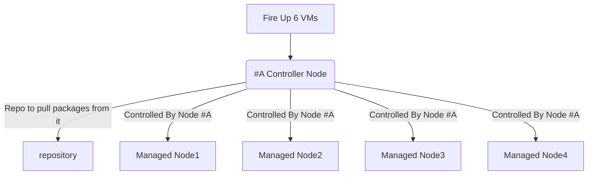

# Ansible Sample Exam for RHCE EX294

This is a sample Ansible exam that I’ve created to prepare for the new RHCE exam EX294. As with the real exam, no answers to the sample exam questions will be provided.

## Requirements

There are 18 questions in total could be more or less.
You will need five RHEL 8 virtual machines to be able to successfully complete all questions.

One VM will be configured as an Ansible control node. Other four VMs will be used to apply playbooks to solve the sample exam questions. The following FQDNs will be used throughout the sample exam.

| FQDN                      | Description                            |
| ------------------------- | -------------------------------------- |
| repo.ansi.example.com     | install packages from                  |
|                           | http://repo.ansi.example.com/BaseOS    |
|                           | http://repo.ansi.example.com/AppStream |
| control.ansi.example.com  | Ansible control node                   |
| managed1.ansi.example.com | managed host                           |
| managed2.ansi.example.com | managed host                           |
| managed3.ansi.example.com | managed host                           |
| managed4.ansi.example.com | managed host                           |



## Lab Setup

> you can create the lab setup manually, but instead i've `Vagrantfile` which you can use inorder to create this setup

## Q1. Ansible Installation and Configuration

- Install the ansible package on the control node
- Create automation user with devops password
- the user should be allowed to execute any command without providing password to the prompt "Add the automation user to sudoers group"
- Create inventory on the control node at /home/automation/plays/inventory. Meet following requirements:

  - managed1.example.com should be a member of the proxy host group
  - managed1.example.com should be a member of the proxy host group
  - managed2.example.com should be a member of the webservers host group
  - managed3.example.com should be a member of the webservers and database host group
  - managed4.example.com should be a member of the database host group
  - proxy and webservers belong to group named public

- Create a config file at /home/automation/plays/ansible.cfg with following requirements:
  - priviledged escalation is disabled by default
  - ansible should manage 8 hosts at a single time
  - use previously defined inventory file by default
  - uses /var/log/ansible/execution.log to save information related to playbook execution
  - roles path should include /home/automation/plays/roles
  - ensure that priviledge escalation method is set to sudo
  - do not allow ansible to ask for password when elevating privileges

## A1. Ansible Installation and Configuration

- **step1:** Installing the ansible

```
yum install -y ansible
```

- **step2:** Configuring the user account

> Create an account

```
useradd automation
```

> Set password

```
echo devops | passwd --stdin automation
```

- **step3:** Allow access to privileged commands

```
echo "automation ALL=(ALL) NOPASSWD:ALL" > /etc/sudoers.d/automation
```

- **step4:** Creating inventory

> Create directory for the inventory

```
mkdir -p /home/automation/plays
mkdir -p /home/automation/plays/roles
sudo mkdir -p /var/log/ansible/
sudo touch /var/log/ansible/execution.log
vim /home/automation/plays/inventory
```

> Create the inventory with following contents

```
[proxy]
managed1.example.com

[webservers]
managed2.example.com
managed3.example.com

[database]
managed3.example.com
managed4.example.com

[public:children]
webservers
proxy
```

> Save it to /home/automation/plays/inventory

- **step5:** Create the config file with following content

> Create the ansible.cfg `ansible configuration file` with following contents

```
[defaults]
inventory = ./inventory
forks = 8
log_path = /var/log/ansible/execution.log
roles_path = ~/.ansible/roles:/usr/share/ansible/roles:/etc/ansible/roles:/home/automation/plays/roles

[privilege_escalation]
become = false
become_ask_pass = false
become_method = sudo
```

> Save it to /home/automation/plays/ansible.cfg

General thoughts

Ensure that you have proper ownership, to restore it call

```
chown -R automation:automation /home/automation
```

> Do the same for /var/log/ansible directory

```
sudo chown -R automation:automation /var/log/ansible
```

## A2. Ad-Hoc Commands

Generate an SSH keypair on the control node. You can perform this step manually.

- Write a script `/home/automation/plays/adhoc` that uses Ansible ad-hoc commands to achieve the following:
  - User automation is created on all inventory hosts (not the control node).
  - SSH key (that you generated) is copied to all inventory hosts for the automation user and stored in `/home/automation/.ssh/authorized_keys`.
  - The automation user is allowed to elevate privileges on all inventory hosts without having to provide a password.

> **After running the adhoc script on the control node as the automation user, you should be able to SSH into all inventory hosts using the automation user without password, as well as a run all privileged commands.**

## Q2. Ad-Hoc Commands

- **step1:** you should test ansible adhoc commands before writing the bash script, the command `ansible localhost -m ping` is usefull, use it few times against target hosts to verify connectivity

- **step2:** you should read and understand the inventory file, if you haven't wrote your inventory by yourself, then you can check the inventory file in this repository.

```
#!/bin/bash
# Create the directory for ssh keys.
ansible localhost -m file -a "path=/home/automation/.ssh state=directory"
# Generate the ssh keys.
ansible localhost -m openssh_keypair -a "path=/home/automation/.ssh/id_rsa owner=automation group=automation type=rsa"
# Create automation user on managed nodes.
ansible all -m user -a "name=automation password={{ 'devops' | password_hash('sha512') }}"
# share public key to managed nodes, remember to check your ansible.cfg configuration because this command needs sudo privileges.
ansible all -m authorized_key -a "key={{ lookup('file', '/home/automation/.ssh/id_rsa.pub') }} user=automation state=present"
# Add the automation user in each managed node to sudoers group for privilege escalation.
ansible all -m copy -a "content='automation ALL=(root) NOPASSWD:ALL' dest=/etc/sudoers.d/automation"
```

## Q3. Archiving

- Create a playbook that meets following requirements:
  - Creates a gzip archive containing `/etc` and stores it at `/backup/configuration.gz` on the managed hosts.
  - Is placed at `/home/automation/plays/archive.yml`
  - Runs against `all` host group
    `Retrieves archives from the managed nodes and stores them at`/backup/<hostname>-configuration.gz` on the control node
  - User automation should be owner of /backup and everything underneath. Both on the managed hosts and the control node. Only owner and members of his group should be able to read and manage files inside. Anyone should be allowed to list contents of `/backup`.
