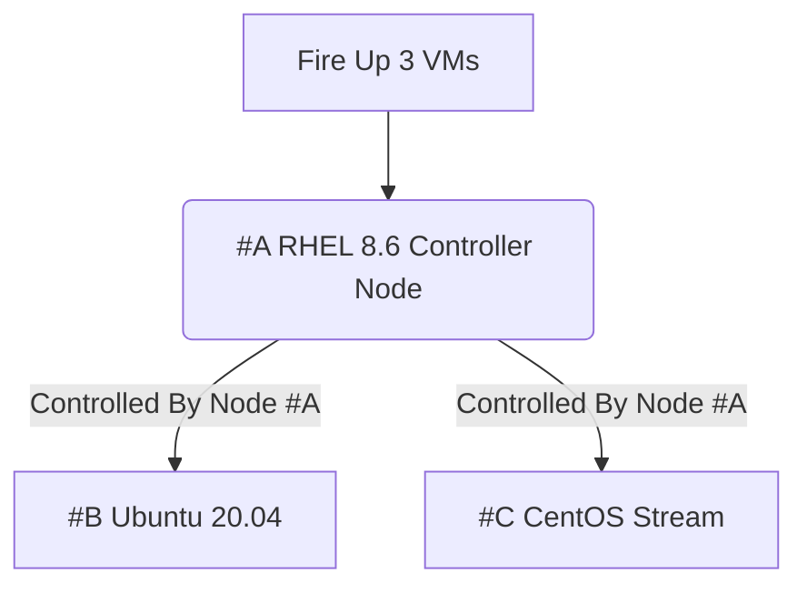

# Linux Administration with Ansible Getting Started with Ansible Automation

## Managing growing linux systems

### Course Overview:
- Installing Ansible and run Ad-Hoc commands
   - 1.1 Installing Ansible-Across many systems
   - 1.2 Understanding Ansible Components
   - 1.3 Configuration of Ansible inventory
 
### Module Overview:
-  Managing systems
-  Scripting Solution
-  Building Lab System

## Lab Systems:
We're going to use the Virtual Systems:
- Red Hat Enterprise Linux 8.6
- Ubuntu 20.04
- CentOS Stream

> please take a look at the diagram below:



## SETTING UP OUR LAB:
<details><summary>SETTING UP OUR LAB</summary>

### Installing the necessary software
In order to be able to follow along you need to install the following software, remember software version is important. therefore, go to the following websites
and install the specified software only and in the same order.
   
> The **VirtualBox and Extension Pack** need to be downloaded with the same version, for example if you decided to install virtualbox 6.1 then the extension pack also need to be 6.1 version as well to avoid bugs or download failer.
   
1. Install the latest VirtualBox, Virtualization technology has many flavors, you can decide whether to use VMware Workstation, Oracle VirtualBox, and virtmanager.
   and for this course i recommend that you use VirtualBox, Please install VirtualBox and VirtualBox Extension Pack.
   
   - How to instal VirtualBox, please go to the following links to install VirtualBox and Extension Pack or you can follow the image links, starting by installing `Virtualbox graphical User Interface Version 6.1.36`, and if you're using windows make sure to choose Windows, or select MacOs if you're using MacOS, for windows users, please install [VirtualBox 6.1 (active maintenance)](https://download.virtualbox.org/virtualbox/6.1.40/VirtualBox-6.1.40-154048-Win.exe) or you can go to [https://www.virtualbox.org/wiki/Downloads](https://www.virtualbox.org/) and install newer versions at your peril.
   

   - How to instal VirtualBox Extension Pack, go to this link for installation [Oracle_VM_VirtualBox_Extension_Pack-6.1.36.vbox-extpack](https://download.virtualbox.org/virtualbox/6.1.36/Oracle_VM_VirtualBox_Extension_Pack-6.1.36-152435.vbox-extpack)
   
> After you've installed VirtualBox and Extension Pack Successfully, you need to add the Extension Pack to VirtualBox, and how to do it ? well, you need to follow the next bullet point, open it and follow along.

<details><summary>How to add the extension pack to VirtualBox</summary>


</details>


2. Install Latest version of Vagrant, Vagrant enables users to create and configure lightweight, reproducible, and portable development environments.
   - To install vagrant please go to this website https://www.vagrantup.com/downloads.html, select Windows and 64-bit or 32-bit depends on your OS
   
<details><summary>How to Install Vagrant</summary>


</details>


### Create the required directories in the Host OS
in order to create following directories, you need to create the following directories in the Path specified bellow.
1. Go to `C:/Users/user-name/vagrant` you need to create a directory called `vagrant` and Under the vagrant Directory create another sub-directory called `ansible`, your directory tree should be: `C:/Users/user-name/vagrant/ansible/`
2. Inside your `C:/Users/user-name/vagrant/ansible/` directory you need to install or write your own `Vagrantfile`
   - To install the Vagrantfile go to this link: [Vagrantfile](https://github.com/Abdulhamid97Mousa/RHCE_EX294_ExamPrep/blob/main/Linux%20Administration%20with%20Ansible%20Getting%20Started%20with%20Ansible%20Automation/Demo_1/Vagrantfile)

3. if you are facing trouble with these two bullet points, i've got images that could help you in creating these directories in the correct places.

<details><summary>How does Vagrantfile look like</summary>


</details>

<details><summary>How to Install Vagrantfile</summary>


</details>


4. After installing `Vagrantfile` please place it under the ansible directory.

<details><summary>Where to place the Vagrantfile</summary>


</details>

</details>


## Running Vagrant and fire up our VMS:
<details><summary>Running Vagrant and fire up our VMS</summary>

In this section, we are going to use the `Powershell` or optionally use `SecureCRT 8.7` to run our script, our script is going to create VMs for us,
the VMs are being mentioned earlier in the diagram, and At this moment we don't have any VMs currently running.


<details><summary>Refer to these image for assistance:</summary>


</details>

> Here we can see that we're being placed at the directory `C:\Users\pc` if you run `Powershell` as administrator, then you will be placed at this directory `C:\Windows\systems32`, being and administrator or not, it doesn't matter.

> Next, in order to run your script Vagrant file you need change your current directory `C:\Windows\systems32` to `C:\Users\user-name\vagrant\ansible\`, to do that you need to enter the following Command:
```
cd C:\Users\user-name\vagrant\ansible
```
<details><summary>Refer to this image:</summary>
 


</details>

> To create and fire-up our VMs we just need enter the command:
```
vagrant up
```

<details><summary>Refer to this image:</summary> 


</details>

</details>

## Verifying and Connecting to our VMs:

<details><summary>Verifying and Connecting to our VMs</summary>

In this section I'm going to use another software instead of `PowerShell` called `SecureCRT`, Why would i do that?
well, working with PowerShell is good but some commands won't be accessible to you and the interface is rigid in my opinion. therefore, i recommend that you install SecureCRT 8.7, to install SecureCRT 8.7 go to this link: [VanDyke_SecureCRT_and_SecureFX_8.7.2_Build_2214.rar](https://getintopc.com/softwares/file-sharing/vandyke-securecrt-and-securefx-free-download/)

> Working with PowerShell or SecureCRT is almost the same.

<details><summary>After installing SecureCRT 8.7 version, open it and make sure you have an interface similar to mine</summary>


</details>

- Next, you need to connect to your local shell.

<details><summary>Please refer to the following images for assistance</summary>


</details>

- Go to `C:/Users/user-name/vagrant/ansible/` and enter the command: `vagrant ssh rhel8` to ssh to each of your VMs, remember VMs names are `rhel8`,`ubuntu` and `stream`, open another window and do the same for ubuntu and CentOS stream:

```
cd C:\Users\user-name\vagrant\ansible
vagrant ssh rhel8
```

<details><summary>Refer to the following images for assistance:</summary>


</details>
</details>
</details>


## Registering our Controller Node RHEL8:
<details><summary>Registering our Controller Node RHEL8</summary>


Once we're connected to our rhel8 VM, we need to Subscribe to Red hat developer portal, to get more information about [No-cost Red Hat Enterprise Linux Individual Developer Subscription:](https://developers.redhat.com/articles/faqs-no-cost-red-hat-enterprise-linux#)

> We must subscribe to Redhat developer program's to use Ansible, if we're not subscribed we won't be able to use ansible, we're still able to use ansible within other distributions such as, ubuntu and stream.

1. We need to check if our Rhel8 System is being subscribed to Redhat developer program's or not, you need to enter the command:
```
sudo subscription-manager status
```
<details><summary>Refer to these images</summary>


</details>

2. To subscribe to Red hat developer program's, we need to go to this website and sign up:[developers.redhat.com](https://developers.redhat.com/)

<details><summary>Refer to these images to sign up to developers.redhat.com</summary>


</details>

> Note: Simple content access simplifies administrator workflows so that you can add, remove, or renew system registrations in a streamlined “register and run” experience. Simply connect Red Hat Enterprise Linux systems and begin installing software. [Learn more about simple content access enablement](https://access.redhat.com/management#)

3. Next, we need to `Disable Simple content access for Red Hat`:[Overview page](https://access.redhat.com/management)

<details><summary>Refer to these images to Disable Simple content access for Red Hat</summary>


</details>

> In short, If you don't Disable Simple content access for Red Hat, your Rhel8 overall status: is going to be Disabled, make sure Simple contect access is disabled on Redhat developer portal, please check the following images for further assistance.

<details><summary>Refer to these images to disable Simple content access for red hat</summary>


</details>

</details>

## Not All OS are the same:

<details><summary>Not All OS are the same</summary>

## Managing Systems:
- you can manage system in the following ways

1. Server by server
   - connecting to each and every single server
   - execute different command while using different linux distributions

2. Scripting Solution
   - As the number of servers grow, shell scripting helped automate the solution and added reliability.

3. Different Systems
   - Whilst our discreet commands or scripts can manage our systems
   - We're still facing the complexity of managing many and different Linux distributions at once,
since we use different commands while using different linux distributions it's difficult to remember each command or how to create a shell script that can work on many distros, and ansible can solve this problem and it is the ultimate solution against varying linux distribuitions, we are going to see the agnostic nature of Ansible, in this course.

For example, let's say that we want to install a package, any package, the command on rhel8 is not going to be the same as ubuntu.
- Software packaging:
  - while using ubuntu the command to install a package is: `apt-get` and 'apt' stands for advance packaging tool
  - while using Rhel8 the command to install a package is: `yum/dnf install` and 'yum' yellow updater manager
- To install vim for example, on Rhel8 `vim` is called `vim-enhanced` whereas on ubuntu it's just called `vim`
- For this problem we can create a shell script that can install vim on Rhel8 CentOS, and ubuntu, Please go to [install-vim.sh](https://github.com/Abdulhamid97Mousa/RHCE_EX294_ExamPrep/blob/main/Linux%20Administration%20with%20Ansible%20Getting%20Started%20with%20Ansible%20Automation/Demo_1/install-vim.sh), you have the choice to write the bash script or download it, after you install it make sure to go to rhel8 and enter the command; `vim install-vim.sh` and then enter the command: `bash install-vim.sh`, if you're looking for the script it self refer to the link above.

> The script provided above supposed to install vim on all VMs.

<details><summary>I've created a shell script that cad do that, please refer to the following images for assistance:</summary> 


</details>

</details>

## Ansible is free Open-Source Python-Based Configuration Management System:

<details><summary>Ansible is free Open-Source Python-Based Configuration Management System</summary>

### Installing Ansible on Rhel8
- Even though we only need to install ansible on the controller node `Single node`, we'll learn the installation on all the three systems.
  - Install Ansible on Rhel8 `Controller Node`
  - Install Ansible on CentOS
  - Install Ansible on Ubuntu 20.04: Using Ubunto PPA

> Note: It doesn't matter which OS that you're using, you still have to configure local repository or install software from repo on the internet.

- Verify the installed versions of Ansible that we need. we need to enter the command:
```
sudo subscription-manager repo --list | grep ansible
```
<details><summary>Please refer to the following images for clarity</summary>


</details>

> Important Note: When we setup our Rhel8 there were additional repos that came with it such as epel and epel-modular repos,
these repos are not part of the Red hat developer program's, these repos contain ansible but not the free version, and it might create problems down the line, so make sure to disable the following repos the command you need to enter is:

```
yum repolist                                                  <---- to check which repository are currently configured on your system
sudo yum install -y dnf-plugins-core                          <---- to install config-manager utility
sudo yum config-manager --disable epel epel-modular           <---- to disable epel and epel-modular repos
```

<details><summary>Please refer to the following images for clarity</summary>


</details>

> Now, We need to enable a specific version of Ansible on Rhel8 Node: `ansible-2.9-for-rhel-8-x86_64-rpm`

for that we need to enter the following command: 
```
sudo subscription-manager repos --enable ansible-2.9-for-rhel-8-x86_64-rpm
```

<details><summary>Please refer to the following images for clarity</summary>


</details>

### Installing Ansible on CentOS
On CentOS there are repos installed that came along side our setup, but these repos doesn't encompass ansible or products that are suitable for enterprise Linux. therefore, we need to install ansible from a repo that we configure manually.

for that we need to enter the command:
```
sudo yum install -y epel-release                       <----- epel-release package has ansible inside it but not enabled
sudo yum install -y ansible
```
<details><summary>Please refer to the following images for clarity</summary>


</details>

### Installing Ansible on Ubuntu
Enabling Ansible on Ubuntu 20.04

for that we need to enter the command:
```
sudo apt-add-repository --yes --update ppa:ansible/ansible                       <----- add a repository
sudo apt install ansible                                                         <----- install Ansible
```
<details><summary>Please refer to the following images for clarity</summary>


</details>


</details>
