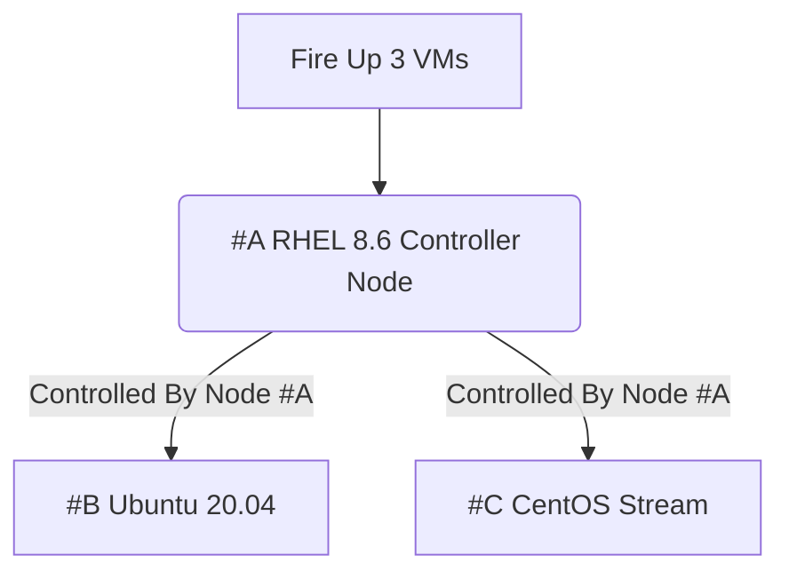

# Linux Administration with Ansible Getting Started with Ansible Automation

## Managing growing linux systems

### Course Overview:
- Installing Ansible and run Ad-Hoc commands
   - 1.1 Installing Ansible-Across many systems
   - 1.2 Understanding Ansible Components
   - 1.3 Configuration of Ansible inventory
 
### Module Overview:
-  Managing systems
-  Scripting Solution
-  Building Lab System

## Lab Systems:
We're going to use the Virtual Systems:
- Red Hat Enterprise Linux 8.6
- Ubuntu 20.04
- CentOS Stream

> please take a look at the diagram below:

## SETTING UP OUR LAB:

SETTING UP OUR LAB

## SETTING UP OUR LAB:
### Installing the necessary software
In order to be able to follow along you need to install the following software, remember software version is important. therefore, go to the following websites
and install the specified software only and in the same order.
   
> The **VirtualBox and Extension Pack** need to be downloaded with the same version, for example if you decided to install virtualbox 6.1 then the extension pack also need to be 6.1 version as well to avoid bugs or download failer.
   
1. Install the latest VirtualBox, Virtualization technology has many flavors, you can decide whether to use VMware Workstation, Oracle VirtualBox, and virtmanager.
   and for this course i recommend that you use VirtualBox, Please install VirtualBox and VirtualBox Extension Pack.
   
   - How to instal VirtualBox, please go to the following links to install VirtualBox and Extension Pack or you can follow the image links, starting by installing `Virtualbox graphical User Interface Version 6.1.36`, and if you're using windows make sure to choose Windows, or select MacOs if you're using MacOS, for windows users, please install [VirtualBox 6.1 (active maintenance)](https://download.virtualbox.org/virtualbox/6.1.40/VirtualBox-6.1.40-154048-Win.exe) or you can go to [https://www.virtualbox.org/wiki/Downloads](https://www.virtualbox.org/) and install newer versions at your peril.
   

   - How to instal VirtualBox Extension Pack, go to this link for installation [Oracle_VM_VirtualBox_Extension_Pack-6.1.36.vbox-extpack](https://download.virtualbox.org/virtualbox/6.1.36/Oracle_VM_VirtualBox_Extension_Pack-6.1.36-152435.vbox-extpack)
   
> After you've installed VirtualBox and Extension Pack Successfully, you need to add the Extension Pack to VirtualBox, and how to do it ? well, you need to follow the next bullet point, open it and follow along.

How to add the extension pack to VirtualBox

2. Install Latest version of Vagrant, Vagrant enables users to create and configure lightweight, reproducible, and portable development environments.
   - To install vagrant please go to this website https://www.vagrantup.com/downloads.html, select Windows and 64-bit or 32-bit depends on your OS
   

How to Install Vagrant

### Create the required directories in the Host OS
in order to create following directories, you need to create the following directories in the Path specified bellow.
1. Go to `C:/Users/user-name/vagrant` you need to create a directory called `vagrant` and Under the vagrant Directory create another sub-directory called `ansible`, your directory tree should be: `C:/Users/user-name/vagrant/ansible/`
2. Inside your `C:/Users/user-name/vagrant/ansible/` directory you need to install or write your own `Vagrantfile`
   - to install the Vagrantfile go to this link: [Vagrantfile](https://github.com/Abdulhamid97Mousa/RHCE_EX294_ExamPrep/blob/main/Linux%20Administration%20with%20Ansible%20Getting%20Started%20with%20Ansible%20Automation/Demo_1/Vagrantfile)

