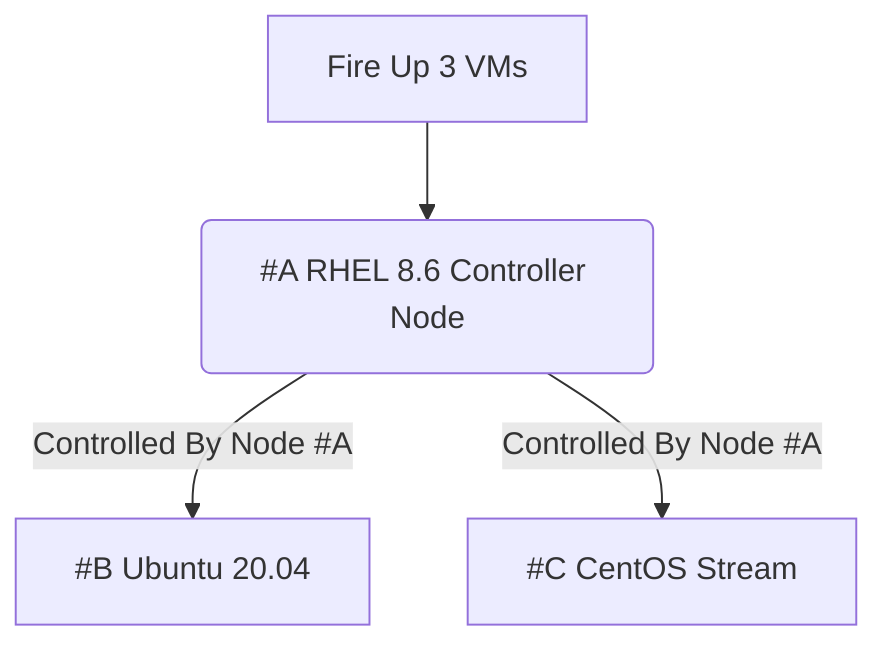

# Linux Administration with Ansible Getting Started with Ansible Automation

## Managing growing linux systems

### Course Overview:
- Installing Ansible and run Ad-Hoc commands
   - 1.1 Installing Ansible-Across many systems
   - 1.2 Understanding Ansible Components
   - 1.3 Configuration of Ansible inventory
 
### Module Overview:
-  Managing systems
-  Scripting Solution
-  Building Lab System

## Lab Systems:
We're going to use the Virtual Systems:
- Red Hat Enterprise Linux 8.6
- Ubuntu 20.04
- CentOS Stream

> please take a look at the diagram below:

SETTING UP OUR LAB

## SETTING UP OUR LAB:
### Installing the necessary software
In order to be able to follow along you need to install the following software, remember software version is important. therefore, go to the following websites
and install the specified software only.
1. Virtualization technology has many flavors, you can decide whether to use VMware Workstation or Oracle VirtualBox, for this course i recommend that you use VirtualBox, Please install VirtualBox and VirtualBox Extension Pack.
   - phical User Interface Version 6.1.36` based on your Host OS i.e. Windows or MacOS, if your are using windows like i do, please install [VirtualBox 6.1 (active maintenance)](https://download.virtualbox.org/virtualbox/6.1.40/VirtualBox-6.1.40-154048-Win.exe) or you can go to [https://www.virtualbox.org/wiki/Downloads](https://www.virtualbox.org/) and install newer versions at your peril.

2. Install Latest version of Vagrant, Vagrant enables users to create and configure lightweight, reproducible, and portable development environments.
   - 

### Create the required directories in the Host OS
in order to create following directories, you need to create the following directories in the Path specified bellow.
1. Go to **C:/Users/<user-name>/_______** you need to create a directory called vagrant
in order  you're following along, you need Windows OS or MacOS
List of required files are:
- Create or install

