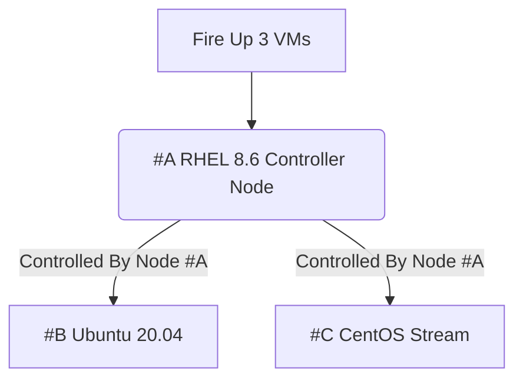

# Getting Started with Ansible Automation Overview:

## Course Overview

<details><summary> Managing Growing Number of Linux VMs</summary>

- [Managing Entire Computer Estates](https://github.com/Abdulhamid97Mousa/RHCE_EX294_Study_Group/wiki/Linux-Administration-with-Ansible:-Getting-Started-with-Ansible-Automation#managing-entire-computer-estates)
- [Building the Vagrant Labs](https://github.com/Abdulhamid97Mousa/RHCE_EX294_Study_Group/wiki/Linux-Administration-with-Ansible:-Getting-Started-with-Ansible-Automation#building-our-vagrant-lab)
- [The Red Hat Enterprise Linux Subscription](https://github.com/Abdulhamid97Mousa/RHCE_EX294_Study_Group/wiki/Linux-Administration-with-Ansible:-Getting-Started-with-Ansible-Automation#registering-our-controller-node-rhel8)
- [Not All OSs Are the Same](https://github.com/Abdulhamid97Mousa/RHCE_EX294_Study_Group/wiki/Linux-Administration-with-Ansible:-Getting-Started-with-Ansible-Automation#not-all-os-are-the-same)
- [Scripting Solution](https://github.com/Abdulhamid97Mousa/RHCE_EX294_Study_Group/wiki/Linux-Administration-with-Ansible:-Getting-Started-with-Ansible-Automation#scripting-the-solution)

</details>

<details><summary> Installing Ansible</summary>

-  [Adding Repositories To Our Linux Distros To Install Ansible](https://github.com/Abdulhamid97Mousa/RHCE_EX294_Study_Group/wiki/Linux-Administration-with-Ansible:-Getting-Started-with-Ansible-Automation#adding-repositories-to-our-linux-distros-to-install-ansible)
-  [Installing Ansible](https://github.com/Abdulhamid97Mousa/RHCE_EX294_Study_Group/wiki/Linux-Administration-with-Ansible:-Getting-Started-with-Ansible-Automation#installing-ansible-1)
-  [Versioning Ansible](https://github.com/Abdulhamid97Mousa/RHCE_EX294_Study_Group/wiki/Linux-Administration-with-Ansible:-Getting-Started-with-Ansible-Automation#versioning-ansible)
-  [investigating Ansible from CLI](https://github.com/Abdulhamid97Mousa/RHCE_EX294_Study_Group/wiki/Linux-Administration-with-Ansible:-Getting-Started-with-Ansible-Automation#investigating-ansible-from-the-cli)

</details>

<details><summary>Ansible Components</summary>

- [Ansible Ad-Hoc Commands vs Ansible-playbook]()
- [Ansible Facts and Variables]()
- [The agnostic nature of Ansible]()
- [YAML and Jinja]()
- [Ansible Configuration]()
- [Host inventory and Node Groups]()


</details>

<details><summary>Ansible Configuration and Inventory</summary>

-  [Adding Repositories To Our Linux Distros To Install Ansible](https://github.com/Abdulhamid97Mousa/RHCE_EX294_Study_Group/wiki/Linux-Administration-with-Ansible:-Getting-Started-with-Ansible-Automation#adding-repositories-to-our-linux-distros-to-install-ansible)

</details>

<details><summary>Executing Ad-Hoc Commands</summary>

-  [Adding Repositories To Our Linux Distros To Install Ansible](https://github.com/Abdulhamid97Mousa/RHCE_EX294_Study_Group/wiki/Linux-Administration-with-Ansible:-Getting-Started-with-Ansible-Automation#adding-repositories-to-our-linux-distros-to-install-ansible)

</details>

## Managing Growing Number of Linux VMs

### Module Overview:
-  [Lab Systems](https://github.com/Abdulhamid97Mousa/RHCE_EX294_Study_Group/wiki/Linux-Administration-with-Ansible-Getting-Started-with-Ansible-Automation/_edit#lab-systems) 
-  [Building Lab System](https://github.com/Abdulhamid97Mousa/RHCE_EX294_Study_Group/wiki/Linux-Administration-with-Ansible:-Getting-Started-with-Ansible-Automation#building-our-vagrant-lab)
-  [Managing Entire Computer Estates](https://github.com/Abdulhamid97Mousa/RHCE_EX294_Study_Group/wiki/Linux-Administration-with-Ansible:-Getting-Started-with-Ansible-Automation#managing-entire-computer-estates)
-  [Not All OS are the same](https://github.com/Abdulhamid97Mousa/RHCE_EX294_Study_Group/wiki/Linux-Administration-with-Ansible:-Getting-Started-with-Ansible-Automation#not-all-os-are-the-same)
-  [Scripting Solution](https://github.com/Abdulhamid97Mousa/RHCE_EX294_Study_Group/wiki/Linux-Administration-with-Ansible:-Getting-Started-with-Ansible-Automation#scripting-the-solution)


### Lab Systems:
We're going to use the Virtual Systems:

| VM     | IP Address | Default Users | Manually Created Users |
| ---      | ---       | ---       | ---       |
| Red Hat Enterprise Linux 8.6 | 192.168.33.11 | root  vagrant | ansible-rhel8 |
| CentOS Stream    | 192.168.33.12 | root  vagrant | ansible-stream |
| Ubuntu 20.04    | 192.168.33.13 | root  vagrant  | ansible-ubuntu |


> **Note:** the reason why we are using many Linux Distros, is because we want you to be familiar with other Linux Distros and prepare your for real world scenarios where you're going to be using and deploying variety of Linux Distros, Please take a look at the diagram below:



### Building Our Vagrant Lab

<details><summary>Building Our Vagrant Lab</summary>

### Building Our Vagrant Lab:

#### Installing the necessary software
In order to be able to follow along you need to install the following software, remember software version is important. therefore, go to the following websites and install the specified software only and in the same order.
   
> The **VirtualBox and Extension Pack** need to be downloaded with the same version. for example, if you decided to install VirtualBox 6.1 and your Extension Pack has the 5.0 build/version you'll probably run through a compatibility issues, you must then download VirtualBox and the extension pack with the same version, the recommended version for both should be 6.1 version to avoid bugs or download failure.
   
1. Install the latest VirtualBox, Virtualization technology has many flavors, you can decide whether to use VMware Workstation, Oracle VirtualBox, and Virtmanager. and for this repository it's recommended that you use VirtualBox, Please install VirtualBox and VirtualBox Extension Pack.
   
   - How to install VirtualBox, please go to the following links to install VirtualBox and Extension Pack or you can follow the image links, starting by installing `VirtualBox graphical User Interface Version 6.1.36`, and if you're using windows make sure to choose Windows, or select MacOS if you're using MacOS, for windows users, please install [VirtualBox 6.1 (active maintenance)](https://download.virtualbox.org/virtualbox/6.1.40/VirtualBox-6.1.40-154048-Win.exe) or you can go to [https://www.virtualbox.org/wiki/Downloads](https://www.virtualbox.org/) and install newer versions at your peril.
   

   - How to install VirtualBox Extension Pack, go to this link for installation [Oracle_VM_VirtualBox_Extension_Pack-6.1.36.vbox-extpack](https://download.virtualbox.org/virtualbox/6.1.36/Oracle_VM_VirtualBox_Extension_Pack-6.1.36-152435.vbox-extpack)
   
> After you've installed VirtualBox and Extension Pack Successfully, you need to add the Extension Pack to VirtualBox, and how to do it ? well, you need to follow the next bullet point, open it and follow along.

<details><summary>How to add the extension pack to VirtualBox</summary>

<br></br>


</details>


2. Install Latest version of Vagrant, Vagrant enables users to create and configure lightweight, reproducible, and portable development environments.
   - To install vagrant please go to this website https://www.vagrantup.com/downloads.html, select Windows and 64-bit or 32-bit depends on your OS
   
<details><summary>How to Install Vagrant</summary>

<br></br>


</details>


#### Create The Required Directories In The Host OS
In order to create following directories correctly, make sure to follow the next steps.
1. Go to `C:/Users/user-name/vagrant` on your Host OS, you need to create a directory called `vagrant` and Under the vagrant Directory create another sub-directory called `ansible`, your directory tree should be: `C:/Users/user-name/vagrant/ansible/`
2. Inside your `C:/Users/user-name/vagrant/ansible/` directory you need to install or write your own `Vagrantfile`
   - To install the Vagrantfile go to this link: [Vagrantfile](https://github.com/Abdulhamid97Mousa/RHCE_EX294_ExamPrep/blob/main/Linux%20Administration%20with%20Ansible%20Getting%20Started%20with%20Ansible%20Automation/Demo_1/Vagrantfile)

3. if you are facing trouble with these two bullet points, I've got images that could help you in creating these directories in the correct places.

<details><summary>How does Vagrantfile look like</summary>

<br></br>


</details>

<details><summary>How to Install Vagrantfile</summary>

<br></br>


</details>


4. After installing `Vagrantfile` please place it under the ansible directory.

<details><summary>Where to place the Vagrantfile</summary>

<br></br>


</details>


### Running Vagrant And Fire Up Our VMS:

In this section, we are going to use the `PowerShell` or optionally use `SecureCRT 8.7` to run our script, our script is going to create VMs for us,
the VMs are being mentioned earlier in the diagram, and At this moment we don't have any VMs currently running.

<details><summary>Refer to these image for assistance:</summary>

<br></br>


</details>

> Here we can see that we're being placed at the directory `C:\Users\pc` if you run `PowerShell` as administrator, then you will be placed at this directory `C:\Windows\systems32`, being and administrator or not, it doesn't matter.

> Next, in order to run your script Vagrant file you need change your current directory `C:\Windows\systems32` to `C:\Users\user-name\vagrant\ansible\`, to do that you need to enter the following Command:
```
cd C:\Users\user-name\vagrant\ansible
```
<details><summary>Refer to this image:</summary>
 
<br></br>


</details>

> To create and fire-up our VMs we just need enter the command:
```
vagrant up
```

<details><summary>Refer to this image:</summary> 

<br></br>


</details>

### Verifying and Connectivity to Our VMs:

In this section I'm going to use another software instead of `PowerShell` called `SecureCRT`, Why would i do that?
well, working with PowerShell is good but some commands won't be accessible to you and the interface is rigid in my opinion. therefore, i recommend that you install SecureCRT 8.7, to install SecureCRT 8.7 go to this link: [VanDyke_SecureCRT_and_SecureFX_8.7.2_Build_2214.rar](https://getintopc.com/softwares/file-sharing/vandyke-securecrt-and-securefx-free-download/)

> Working with PowerShell or SecureCRT is almost the same.

<details><summary>After installing SecureCRT 8.7 version, open it and make sure you have an interface similar to mine</summary>

<br></br>


</details>

- Next, you need to connect to your local shell.

<details><summary>Please refer to the following images for assistance</summary>

<br></br>


</details>

- Go to `C:/Users/user-name/vagrant/ansible/` and enter the command: `vagrant ssh rhel8` to ssh to each of your VMs, remember VMs names are `rhel8`,`ubuntu` and `stream`, open another window and do the same for ubuntu and CentOS stream:

```
cd C:\Users\user-name\vagrant\ansible
vagrant ssh rhel8
```

<details><summary>Refer to the following images for assistance:</summary>

<br></br>


</details>

</details>


### Registering our Controller Node RHEL8:

<details><summary>The Red Hat Enterprise Linux Subscription </summary>

Once we're connected to our rhel8 VM, we need to Subscribe to Red hat developer portal, to get more information about [No-cost Red Hat Enterprise Linux Individual Developer Subscription:](https://developers.redhat.com/articles/faqs-no-cost-red-hat-enterprise-linux#)

> We must subscribe to Redhat developer program's to use Ansible, if we're not subscribed we won't be able to use ansible, we're still able to use ansible within other distributions such as, ubuntu and stream.

1. We need to check if our Rhel8 System is being subscribed to Redhat developer program's or not, you need to enter the command:
```
sudo subscription-manager status
```
<details><summary>Refer to these images</summary>

<br></br>


</details>

2. To subscribe to Red hat developer program's, we need to go to this website and sign up:[developers.redhat.com](https://developers.redhat.com/)

<details><summary>Refer to these images to sign up to developers.redhat.com</summary>

<br></br>


</details>

> **Note:** Simple content access simplifies administrator workflows so that you can add, remove, or renew system registrations in a streamlined “register and run” experience. Simply connect Red Hat Enterprise Linux systems and begin installing software. [Learn more about simple content access enablement](https://access.redhat.com/management#)

3. Next, we need to `Disable Simple content access for Red Hat`:[Overview page](https://access.redhat.com/management)

<details><summary>Refer to these images to Disable Simple content access for Red Hat</summary>

<br></br>


</details>

> In short, If you don't Disable Simple content access for Red Hat, your Rhel8 overall status: is going to be Disabled, make sure Simple contect access is disabled on Redhat developer portal, please check the following images for further assistance.

<details><summary>Refer to these images to disable Simple content access for red hat</summary>

<br></br>


</details>

</details>

### Managing Entire Computer Estates:

<details><summary>Managing Entire Computer Estates</summary>

you can manage systems in the following ways:

1. Server by Server
   - connecting to each and every single server
   - execute different command while using different linux distributions

2. Scripting Solution
   - As the number of servers grow, shell scripting helped automate the solution and added reliability.

</details>


### Not All OS are the same:

<details><summary>Different Systems</summary>

> **Note:** Whilst our discreet commands or scripts can manage our systems, We're still facing the complexity of managing many and different Linux distributions at once, since we use different commands while using different Linux distributions it's difficult to remember each command or how to create a shell script that can work on many distros, and ansible can solve this problem and it is the ultimate solution against varying Linux distributions, we are going to see the agnostic nature of Ansible, in this repository.

For example, let's say that we want to install a package, any package, the command on rhel8 is not going to be the same as in ubuntu 20.04.

</details>

### Scripting the Solution:

<details><summary>Software packaging:</summary>

  - while using ubuntu the command to install a package is: `apt-get` and 'apt' stands for advance packaging tool
  - while using Rhel8 the command to install a package is: `yum/dnf install` and 'yum' yellow updater manager
- To install vim for example, on Rhel8 `vim` is called `vim-enhanced` whereas on ubuntu it's just called `vim`
- For this problem we can create a shell script that can install vim on Rhel8 CentOS, and ubuntu, Please go to [install-vim.sh](https://github.com/Abdulhamid97Mousa/RHCE_EX294_ExamPrep/blob/main/Linux%20Administration%20with%20Ansible%20Getting%20Started%20with%20Ansible%20Automation/Demo_1/install-vim.sh), you have the choice to write the bash script or download it, after you install it make sure to go to rhel8 and enter the command; `vim install-vim.sh` and then enter the command: `bash install-vim.sh`, if you're looking for the script it self refer to the link above.

> The script provided above supposed to install vim on all VMs.

<details><summary>I've created a shell script that cad do that, please refer to the following images for assistance:</summary> 

<br></br>


</details>

</details>

</details>

## Installing Ansible

### Module Overview:
-  [Adding Repositories To Our Linux Distros To Install Ansible](https://github.com/Abdulhamid97Mousa/RHCE_EX294_Study_Group/wiki/Linux-Administration-with-Ansible:-Getting-Started-with-Ansible-Automation#adding-repositories-to-our-linux-distros-to-install-ansible) 
-  [Installing Ansible](https://github.com/Abdulhamid97Mousa/RHCE_EX294_Study_Group/wiki/Linux-Administration-with-Ansible:-Getting-Started-with-Ansible-Automation#installing-ansible-1)
-  [Versioning Ansible](https://github.com/Abdulhamid97Mousa/RHCE_EX294_Study_Group/wiki/Linux-Administration-with-Ansible:-Getting-Started-with-Ansible-Automation#versioning-ansible)
-  [Investigating Ansible from the CLI](https://github.com/Abdulhamid97Mousa/RHCE_EX294_Study_Group/wiki/Linux-Administration-with-Ansible:-Getting-Started-with-Ansible-Automation#investigating-ansible-from-the-cli)
-  [Configuring Managed Hosts](https://github.com/Abdulhamid97Mousa/RHCE_EX294_Study_Group/wiki/Linux-Administration-with-Ansible:-Getting-Started-with-Ansible-Automation#configuring-managed-hosts)
-  [Configuring The Ansible Users](https://github.com/Abdulhamid97Mousa/RHCE_EX294_Study_Group/wiki/Linux-Administration-with-Ansible:-Getting-Started-with-Ansible-Automation#configuring-the-ansible-users)
-  [Setting Up SSH For Ansible Users](https://github.com/Abdulhamid97Mousa/RHCE_EX294_Study_Group/wiki/Linux-Administration-with-Ansible:-Getting-Started-with-Ansible-Automation#setting-up-ssh-for-ansible-users)

### Adding Repositories To Our Linux Distros To Install Ansible

<details><summary>Adding Repositories To Our Linux Distros To Install Ansible</summary>

### UNDERSTANDING INSTALLATION METHODS

Ansible is open-source software, and as a result, Ansible can be installed on many platforms, each of which comes with its own installation method. In this repo we cover installation of Ansible on either Red Hat Enterprise Linux 8 or CentOS 8. On both platforms you can install Ansible from the distribution repositories or using Python pip. In the following sections you read how to do this.

> **Note:** Use the instructions that correspond to the operating system and installation method that you want to use.

### Installing Ansible on Rhel8
- Even though we only need to install ansible on the controller node `Single node`, we'll learn the installation on all the three systems.
  - Install Ansible on Rhel8 `Controller Node`
  - Install Ansible on CentOS
  - Install Ansible on Ubuntu 20.04: Using Ubuntu PPA

> **Note:** It doesn't matter which OS that you're using, you still have to configure local repository or install software from repo on the internet.

- Verify the installed versions of Ansible that we need. we need to enter the command:
```
sudo subscription-manager repo --list | grep ansible
```
<details><summary>Please refer to the following images for clarity</summary>

<br></br>


</details>

</details>


### Installing Ansible

<details><summary>Installing Ansible</summary>

### Installing Ansible on RHEL8 VM

> **Important Note:** When we setup our Rhel8 there were additional repos that came with it such as epel and epel-modular repos,
these repos are not part of the Red hat developer program's, these repos contain ansible but not the free version, and it might create problems down the line, so make sure to disable the following repos the command you need to enter is:

```
yum repolist                                                  <---- to check which repository are currently configured on your system
sudo yum install -y dnf-plugins-core                          <---- to install config-manager utility
sudo yum config-manager --disable epel epel-modular           <---- to disable epel and epel-modular repos
```

<details><summary>Please refer to the following images for clarity</summary>

<br></br>


</details>


> Now, We need to enable a specific version of Ansible on Rhel8 Node: `ansible-2.9-for-rhel-8-x86_64-rpm`

for that we need to enter the following command: 
```
sudo subscription-manager repos --enable ansible-2.9-for-rhel-8-x86_64-rpm
```

<details><summary>Please refer to the following images for clarity</summary>

<br></br>


</details>

### Installing Ansible on CentOS
On CentOS there are repos installed that came along side our setup, but these repos doesn't encompass ansible or products that are suitable for enterprise Linux. therefore, we need to install ansible from a repo that we configure manually.

for that we need to enter the command:
```
sudo yum install -y epel-release                       <----- epel-release package has ansible inside it but not enabled
sudo yum install -y ansible
```
<details><summary>Please refer to the following images for clarity</summary>

<br></br>


</details>

### Installing Ansible on Ubuntu

Enabling Ansible on Ubuntu 20.04

for that we need to enter the command:
```
sudo apt-add-repository --yes --update ppa:ansible/ansible                       <----- add a repository
sudo apt install ansible                                                         <----- install Ansible
```
<details><summary>Please refer to the following images for clarity</summary>

<br></br>


</details>

### Using python-pip to Install Ansible

Ansible is completely written in the scripting language Python, and Python includes its own package manager:
python-pip. As a result, for software that is written in Python, you can use either the package manager of your
Linux repository or the python-pip software manager. Because Ansible is written in Python, this applies to Ansible as well.

The advantage of using python-pip is that it is an advanced method of managing software, often giving you
access to the most recent version of the software before it is available in the repositories of your distribution. The
disadvantage is that the software isn’t controlled from your distribution, which makes it harder to manage software updates from a generic interface.

> how to install Ansible from the python-pip installer.

1. From a root shell on your CentOS or RHEL 8 control node, type **yum install -y python3-pip** to install the Python 3 pip installer.

2. Type **alternatives --set python /usr/bin/python3** . This creates a symbolic link with the name python that allows you to start the python3 binary.

3. Exit the root shell, and open a shell as your Ansible user. From the ansible user shell, type **pip3 install ansible --user**.

4. Once the installation completes, type **ansible --
version** to verify that Ansible has been
installed.

</details>


### Versioning Ansible

<details><summary>Versioning Ansible</summary>

> If we took a look at the executable itself to see what type of command is ansible, we can see the following:

```
file $(which ansible)
```
<details><summary>Please open this collapse block to know What the above command returns</summary>

<br></br>

The **file** command help us determine the type of the file, it's a very useful command, and The **Which** command help us determine the full path to the command, or where the command was executed from.


> We can see the type of the file, and it's a Python Script, and it was executed from `/usr/bin/ansible`, we also know that the command **ls** is executed from `/usr/bin/ls`

> a little bit about the command ansible, from the man pages, ansible is  **An extra-stimple tool/framework/API for doing `remote things` this command allows you to define and run a single task `playbook` against a set of hosts**

> This is also the case when we execute the following command:

```
file $(which ansible-playbook)
```


> It's understood that **ansible-playbook** command is actually a symbolic link to Ansible, and everything to do with ansible is based on python.

</details>

### Ansible Version

As of May 2021, the steps in this repository, will install **Ansible 2.9.xx**, and no matter which distribution was chosen as the controller node.

> To check which version of Ansible is installed, we can execute the following Command:

```
ansible --version
```

<details><summary>Please open this collapse block to know What the above command returns</summary>

> Excuting the **ansible --version** is very important command, because it tell us also about the underlying version of Python, working with later version of python means that we have more modules to work with and more security features will be available for free to all Ansible users. if you use ubuntu, you will have a later version of python, but if you decided to work with rhel8 you might have to deal with older versions of python.


> We also get to see the configuration files, but where can we find ansible modules ? Well, we can see where ansible is located, but additional python version that we're using behind out ansible program, if we look at:

```
ls /home/vagrant/.ansible/plugins/modules               <--- this returns nothing because the directory doesn't exist yet.
ls /usr/share/ansible/plugins/modules                   <--- the directory exist, because it was added during the installation, but it's empty for now
ls /usr/lib/python3.6/site-packages/ansible             <--- Here we can see python modules, few of them has the extension .py,
```

</details>

</details>

### Investigating Ansible from the CLI 

<details><summary>Investigating Ansible from the CLI </summary>

<br></br>


> If we look underneath the main context, how these modules be accessed. When we look underneath the main modules directory, this would then be used predominantly by our remote executional or ad-hoc commands, we'll be able to see a grouping of python modules based on their purpose

```
ls /usr/lib/python3.6/site-packages/ansible/modules
```


> Again, we see a lot of directories, but these modules are then representing the purpose, like module for messaging, or module for networking and so on.

```
ls /usr/lib/python3.6/site-packages/ansible/modules/system/
```


> Here, we can see a lot of modules related to managing your system, and we can see such as the time-zone and the ping so on. if we then go back to 
`/usr/lib/python3.6/site-packages/ansible/playbook/` directory, in here, we are looking to modules specific to playbooks, we can run some of the others, the other modules we've look at, but these are specific to what could be used within playbook, such as **loop_include.py**, or **play_context.py**, etc. Much of this will be clearer when we go through this repository. 


</details>

### Configuring Managed Hosts

<details><summary>Configuring Managed Hosts</summary>

Managed hosts in an Ansible environment don’t need a lot. Opposed to what is needed in some other configuration management solutions, no agents need to be installed on the managed hosts. You only have to **enable SSH access and ensure that Python is available on the managed hosts**.

If you want to manage non-Linux nodes, notice that additional steps might be required. To manage Windows with Ansible, for instance, you must enable a Windows-native remote access mechanism, like Windows Remote Management (WinRM) or the Windows SSH daemon, and if you want to manage network devices, you might have to use device-specific requirements. This is not relevant for RHCE EX294 though, where you only have to manage Linux machines with Ansible.

1. On your RHEL 8 managed nodes, open a root
shell.

2. Type `systemctl status sshd` to verify whether the SSH process is running and available to
receive incoming connections. SSH is automatically installed and started on a RHEL/CentOS 8 installation, so no further action should be required here.

<details><summary>For clarity Please open</summary>


</details>

3.Type `rpm -qa | grep python`. You should now see a list of packages. Often, you do not need to
manually install Python on RHEL or CentOS 8 because it’s a part of the default configuration in most installation types.

<details><summary>For clarity Please open</summary>


</details>

4. Finally, type `firewall-cmd --list-all`. In the list of services, you should see that ssh is listed. This
means that the remote host is accessible through ssh as well.

<details><summary>For clarity Please open</summary>


</details>

5. From the **Controller node Rhel8** to **Managed node CentOS-Stream**, you have to `ssh USER@IPADDRESS` to managed node to verify accessibility, by default from the initial setup that we've provided you, you've got **vagrant User** and you can't issue commands without elevated privileges, it's understood that you could use the **sudo** command while using vagrant user, but remember while managing an environment with ansible you **Must use a dedicated user account** , and by default **Key based Authentication** is enabled on all three VMs, If you type `ssh vagrant@192.168.33.12`. 

> **Note:** in the lab setup we mentioned the IP address for each node, **Rhel8:192.168.33.11, CentOS-Stream:192.168.33.12, and Ubuntu-20.04:192.168.33.13**,  This  command `ssh vagrant@192.168.33.12` opens an SSH session to vagrant user of CentOS Machine, which verifies that everything required is up and running.

> **Note:** you still might not be able to connect to vagrant user on CentOS because you don't have the public key to vagrant user of CentOS-Stream machine. So, what to do ? Well, you've got three options:
- Login as root and **Disable** Key based Authentication which's not **Recommended**.
- Go to your **Controller Node Rhel8** as vagrant user and copy the content of the public key across to your **Managed Node CentOS** vagrant user, make sure that content of your public key of Rhel8 vagrant user is being placed in the `/.ssh/authorized_keys` of CentOS vagrant user's file.
- What i recommend that you do is, you go ahead and create a user with the name **ansible-rhel8** on controller node and another user **ansible-stream** on the Managed node, and then generate ssh keys on controller node, and then copy public key across to your managed node. 


<details><summary>How to create Users (ansible-rhel8, ansible-stream, and ansible-ubuntu)?, to find out open me</summary>


</details>

> **Important Note:** Please go to section Configuring The Ansible Users for more clarity.

</details>

### Configuring The Ansible Users

<details><summary>Configuring The Ansible Users</summary>

While managing an environment with Ansible, you need a dedicated user account. In this repo I use a user with
the name “ansible” in all examples, this means **ansible-rhel8 on rhel8 machine**, **ansible-stream on CentOS**, and **ansible-ubuntu on Ubuntu**. Obviously, in a production environment you can pick any username you would like. Because the examples in this repo all use the username “ansible,” I advise you to create a user with that name as well.

> **Note:**  The ansible user is used to run the ansible scripts on the managed hosts. To do so, you issue an `ssh` command under the hood, which allows Ansible to push a Python script that performs all configuration tasks on the managed machines. For this procedure to work easily, two steps are required for setting up the ansible user:

1. The user must be able to SSH into the managed machines.
2. The user must be enabled to run tasks as root on the managed machines.

</details>

### Setting Up SSH For Ansible Users

<details><summary>Setting Up SSH For Ansible Users</summary>

Setting up SSH to allow the ansible user to log in to a managed host is not difficult. Just ensure the user
account exists on all machines and use the ssh command. You should consider how to configure SSH access though.

If nothing is configured, the user needs to enter a password each time the remote connection is
established. Although secure, this is not convenient, especially not in an environment where Ansible is used to manage remote machines.

The most convenient way to connect to managed machines is by using SSH public/private keys, and that is
exactly what we’re going to do in our sample configuration. SSH public/private keys can be used as authentication credentials, and because a private key cannot be guessed, it is considered a more secure way to log in to managed hosts.

To work with public/private keys, a passphrase may be used to further secure private key access. Normally, the
private key should be accessible by the user who owns the key only, which is accomplished by putting the key in
a secured place in the user home directory. If, however, someone would be able to copy the user private key, the
user identity would be stolen and freely accessible. For that reason, it makes sense to secure the private key with a passphrase.

> **Note:** A passphrase is like a password; it needs to be entered each time the private key is used. Using passphrases
makes using public/private key pairs a lot more secure, but it makes working with Ansible a little less convenient
as well. For that reason, on the RHCE exam, you don’t have to secure SSH setup with passphrases, and you can work with password-less private keys.

#### Setting Up SSH Key-Based User Authentication

1. On Rhel8 VM, open a shell as the user ansible-rhel8.

2. Type `ssh-keygen` command. Press Enter to accept the default file name for storing the private key.

3. When prompted for a passphrase, press Enter. This configures a passphrase-less private key, meaning no passphrase. Press Enter again to confirm.

<details><summary>How to generate SSH public/private keys, to know how, please open me</summary>


</details>

- After generating the public/private key-pair, type `ssh-copy-id ansible-stream@192.168.33.12` command and press enter. This prompts for the user ansible-stream password on server CentOS, **Now this might not work straight away**, so please follow the steps bellow:
  - You need to configure a password for ansible-stream user, and the same for all other users **ansible-rhel8 and ansible-ubuntu**.
  - You need to add ansible-stream user to sudoers group. to do that, you need to issue the command `usermod -a -G wheel ansible-stream`
  - You need to configure sshd.service to **disable key based authentication** and **enable Password Authentication** on CentOS VM, to allow for public key to be sent to ansible-stream user, to do that you need to issue the command `sudo vim /etc/ssh/sshd_config`, while editing the file, look for `PubkeyAuthentication no` make sure to set it to `no`
  - After the previous step, you will have to restart your sshd.service, to do that you need to issue the command `systemctl restart sshd.service` and this would allow for updating configurations. 
  - Next, you will have to issue the command `ssh-copy-id ansible-stream@192.168.33.12`, but this time you'll be prompted to enter a password for ansible-stream user, after successfully copying the public key from ansible-rhel8 user to the appropriate location on CentOS ansible-stream user. 
  - Please after copying the public key over to the designated user go ahead and **disable Password authentication** and **Re-enable key based authentication**  to do that, you need to issue the command `sudo vim /etc/ssh/sshd_config`, make sure to set **PasswordAuthentication no** and **PubKeyAuthentication yes**, and remember to restart sshd.service, to do that issue the command `sudo systemctl restart sshd.service`
  - Finally, check if the key based authentication is working properly**, Repeat this step for ansible-ubuntu user, using the command `ssh-copy-id ansible-ubuntu`.

<details><summary>How to copy SSH pub key to ansible-stream, to know please open me</summary>


</details>

4. Verify that the passphrase-less private key has been correctly configured by using ssh ansible-strean@192.168.33.12. You should get access to a prompt on ansible-stream without having to enter a password or anything.

</details>

## Understanding Ansible Components

### Module Overview:
-  [Ansible Ad-Hoc Commands vs Ansible-playbook]() 
-  [Ansible facts and variables]()
-  [The agnostic nature of Ansible]()
-  [YAML and Jinja]()
-  [Ansible Configuration]()
-  [Host inventory and node groups]()

### Ansible Ad-Hoc Commands vs Ansible-playbook

<details><summary>Ansible Ad-Hoc Commands vs Ansible-playbook</summary>

When we use `ansible` command from the command line interface, we're issuing what Ansible describe as *Ad-Hoc Commands*, Ad hoc
commands are easy to use and they are fast, and for that reason, they are commonly used.

#### What are Ad-Hoc Commands ?
An ad hoc command is an Ansible task that you can run against managed hosts without the need to use any playbook files or other script-like solutions.

#### What are Ad-Hoc Commands used for ?
- Setup tasks that bring nodes to a desired state
- Quick tests to verify that a playbook was indeed successful
- Quick discovery tasks to verify that a node meets certain criteria

#### How does the command look like ?


This command contains a few ingredients. To start with, there is the `ansible` command, which is the command
for running ad hoc commands. Next, you need to specify on which hosts you want to target to run the ad hoc commands against,
which is accomplished by the `all` or you can specify `localhost`, localhost is implicitly defined and doesn't necessarily need to exist in an inventory, we'll get to see what're inventory later in the course. The third element refers to the module that you want to
run. A module is a script that is executed by Ansible to perform a specific task. In the sample command shown,
the -m option is used to call the module, and the specific module in this example is user. Finally, you need to
provide arguments to the module by using the -a option. In an ad hoc command, all arguments are provided
between double quotes. In this case there is just one argument, but if there are many arguments, all of them
need to be included between double quotes. Table 4-2 summarizes all these components of the ad hoc command.

When running an ad hoc command, you must be using your Ansible user account is (not root), and you must be in
a project directory where the **inventory** file and the **ansible.cfg** file can be found. Next, you run the command
ansible all -m user -a “name=lisa”, which reaches out to all hosts in inventory to ensure that user lisa
exists.

While doing so, Ansible compares the desired state (which is what you just specified in the ad hoc command)
with the current state of the managed machine, and if so required, it applies changes to the managed machine. you can see what the output of the command
looks like. Notice the listing executed the command on ungrouped, which refers to all hosts that are not a part of any specific group.


shows the output of the ad hoc command. You can see that the first line shows ansible2 | SUCCESS.
This line indicates that host ansible2 already meets the desired state, and as a result, no changes had to be
applied. For host ansible1, you can see ansible1 CHANGED, which indicates that host ansible1 did not
meet the desired state yet, and changes had to be applied.
This is how each Ansible command works. 
Ansible commands are **idempotent**, **idempotent means that regardless of the current condition, Ansible brings the managed
host to the desired state. No matter how often you run the command, it always results in the same desired state.**
This is what is referred to as the idempotent behavior of Ansible commands: even if you run a command multiple times, the result is always the same.


</details>

</details>

